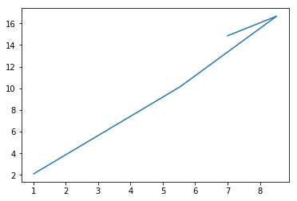

## Simple Linear Regression Project

In this project, we are going to make a linear regression machine learning model from scratch without using any machine learning libraries. We will create a simple data set and train the model using this data set. Then we will do the prediction on the data set to see the accuracy of the model.

## Data Set

Let us creat a small simple data set first and assign the columns to x and y values. x will be used as feature column and y will be used as target column.


```python
data = [[1.0100, 2.1122], [5.5277, 10.1302], [8.5186, 16.6620], [7.0032,14.8540]]
```


```python
x = [row[0] for row in data]
y = [row[1] for row in data]
```

**Let us plot the data set to vizualize.**


```python
import matplotlib.pyplot as plt
%matplotlib inline

plt.plot(x,y)
plt.show()
```





## Create Model

### Simple linear regression formula

**DEFINITIONS:**

b1 - This is the SLOPE of the regression line. Thus this is the amount that the Y variable (dependent) will change for each 1 unit change in the X variable.

b0 - This is the intercept of the regression line with the y-axis. In otherwords it is the value of Y if the value of X = 0.

y = b0 + b1(x) - This is the sample regression line. You must calculate b0 & b1 to create this line. Y-hat stands for the predicted value of Y, and it can be obtained by plugging an individual value of x into the equation and calculating y-hat.

#### y = b0 + b1*x
#### B1 = sum((x(i)-mean(x)) * sum((y(i)- mean(y)))) / sum((x(i)- mean(x))^2)
#### B0 = mean(y) - B1*mean(x)

**So we need to find Mean, Variance and Co-variance to calculate Co efficients b1 & b0**

### Mean


```python
# mean(x) = sum(x)/ count(x)

def mean(values):
    return sum(values)/float(len(values))
```

### Variance


```python
#variance = sum( (x - mean(x))^2 )
def variance(values, mean):
    return sum([(x-mean)**2 for x in values])
    
```

Let us check the mean and variance for our data set


```python

mean_x, mean_y = mean(x), mean(y)
var_x, var_y = variance(x, mean_x), variance(y, mean_y)
print('x stats: mean=%.3f variance=%.3f' % (mean_x, var_x))
print('y stats: mean=%.3f variance=%.3f' % (mean_y, var_y))

```

    x stats: mean=5.515 variance=31.532
    y stats: mean=10.940 variance=126.647


### Co Variance


```python
# covariance = sum((x(i) - mean(x)) * (y(i) - mean(y)))
def covariance(x, mean_x, y, mean_y):
    covar = 0.0
    for i in range (len(x)):
        covar += (x[i]- mean_x)* (y[i]-mean_y)
    return covar              
               
    
```


```python
covar = covariance(x, mean_x, y, mean_y)
print ('covariance:%.3f' % (covar))
```

    covariance:62.770


### Co efficients - B0 and B1

 B1 = sum((x(i) - mean(x)) * (y(i) - mean(y))) / sum( (x(i) - mean(x))^2 )
 so we can simplify it to
 B1 = covariance(x, y) / variance(x)

AND

B0 = mean(y) - B1 * mean(x)


```python
def coefficients(data):
    x = [row[0] for row in data]
    y = [row[1] for row in data]
    x_mean, y_mean = mean(x), mean(y)
    b1 = covariance(x, x_mean, y, y_mean)/variance(x, x_mean)
    b0 = y_mean - b1 * x_mean    
    return [b0, b1]
```


```python
b0, b1 = coefficients(data)
print (' coefficients: B0=%.3f, B1=%.3f' % (b0, b1))
```

     coefficients: B0=-0.039, B1=1.991


### Make Predictions


```python
# Make predictions
# y = b0 + b1 * x

def simple_linear_regression(train, test):
    predictions = list()
    b0, b1 = coefficients(train)
    for row in test:
        yhat = b0 + b1 * row[0]
        predictions.append(yhat)
    return predictions


```


```python
simple_linear_regression(data, data)
```


    [1.9716689323220757, 10.96513094501911, 16.919166302341544, 13.902433820317263]


### Evaluate Model

Finally, we need to check the accuracy of our model. So we will calculate the root mean squared error.


```python
from math import sqrt

# Calculate root mean squared error
def rmse_metric(actual, predicted):
    sum_error = 0.0
    for i in range(len(actual)):
        prediction_error = predicted[i] - actual[i]
        sum_error += (prediction_error ** 2)
    mean_error = sum_error / float(len(actual))
    return sqrt(mean_error)


```

**We will evaluate the algorithm on training test first**


```python
# Evaluate regression algorithm on training dataset
def evaluate_algorithm(dataset, algorithm):
    test_set = list()
    for row in dataset:
        row_copy = list(row)
        row_copy[-1] = None
        test_set.append(row_copy)
    predicted = algorithm(dataset, test_set)
    print(predicted)
    actual = [row[-1] for row in dataset]
    rmse = rmse_metric(actual, predicted)
    return rmse
```


```python
rmse = evaluate_algorithm(data, simple_linear_regression)
print('RMSE: %.3f' % (rmse))
```

    [1.9716689323220757, 10.96513094501911, 16.919166302341544, 13.902433820317263]
    RMSE: 0.650


**Now we will evaluate our model on new data set to check the accuracy of our model on unseen the data.**


```python
# Test simple linear regression
dataset = [[1, 1], [2, 3], [4, 3], [3, 2], [5, 5]]
rmse = evaluate_algorithm(dataset, simple_linear_regression)
print('RMSE: %.3f' % (rmse))
```

    [1.1999999999999995, 1.9999999999999996, 3.5999999999999996, 2.8, 4.3999999999999995]
    RMSE: 0.693


**You can see that RMSE value on both known and unknown data sets are almost equal. But slightly higher on new data** 

**Lower values of RMSE indicate better fit.**

**This indicates that our linear regression model is OK. This model can be improved with further training and gradient descent function**


```python

```
