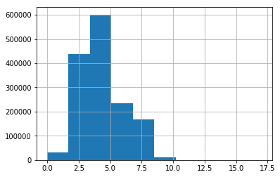
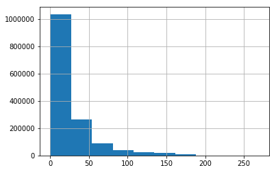
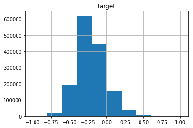
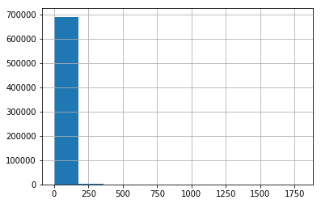

## Neural Network Model using keras

**This project was done for Kaggle competition** [kaggle.com](https://www.kaggle.com/c/mercari-price-suggestion-challenge)

In this competition, Mercari(Japan’s biggest community-powered shopping app) challenging you to build an algorithm that automatically suggests the right product prices. You’ll be provided user-inputted text descriptions of their products, including details like product category name, brand name, and item condition.


Product pricing gets even harder at scale, considering just how many products are sold online. Clothing has strong seasonal pricing trends and is heavily influenced by brand names, while electronics have fluctuating prices based on product specs.

**Acknowledgement**

This kernal influenced by excellent kernal from [noobhound](https://www.kaggle.com/knowledgegrappler/a-simple-nn-solution-with-keras-0-48611-pl).


```python
# This Python 3 environment comes with many helpful analytics libraries installed
# It is defined by the kaggle/python docker image: https://github.com/kaggle/docker-python
# For example, here's several helpful packages to load in 

import numpy as np # linear algebra
import pandas as pd # data processing, CSV file I/O (e.g. pd.read_csv)
from sklearn.preprocessing import LabelEncoder, MinMaxScaler, StandardScaler
from sklearn.cross_validation import train_test_split

import matplotlib.pyplot as plt
%matplotlib inline 

import math

# Input data files are available in the "../input/" directory.
# For example, running this (by clicking run or pressing Shift+Enter) will list the files in the input directory

import os
print(os.listdir("../input"))

# Any results you write to the current directory are saved as output.


```

    ['test_stg2.tsv', 'train.tsv', 'test.tsv', 'sample_submission_stg2.csv', 'sample_submission.csv']


    /opt/conda/lib/python3.6/site-packages/sklearn/cross_validation.py:41: DeprecationWarning: This module was deprecated in version 0.18 in favor of the model_selection module into which all the refactored classes and functions are moved. Also note that the interface of the new CV iterators are different from that of this module. This module will be removed in 0.20.
      "This module will be removed in 0.20.", DeprecationWarning)


```python
def rmsle(y, y_pred):
    assert len(y) == len(y_pred)
    to_sum = [(math.log(y_pred[i] + 1) - math.log(y[i] + 1)) ** 2.0 for i,pred in enumerate(y_pred)]
    return (sum(to_sum) * (1.0/len(y))) ** 0.5
#Source: https://www.kaggle.com/marknagelberg/rmsle-function
```


```python
#LOAD DATA
print("Loading data...")
train = pd.read_table("../input/train.tsv")
test = pd.read_table("../input/test.tsv")
print(train.shape)
print(test.shape)
```

    Loading data...
    (1482535, 8)
    (693359, 7)


```python
train.info()
```

    <class 'pandas.core.frame.DataFrame'>
    RangeIndex: 1482535 entries, 0 to 1482534
    Data columns (total 8 columns):
    train_id             1482535 non-null int64
    name                 1482535 non-null object
    item_condition_id    1482535 non-null int64
    category_name        1476208 non-null object
    brand_name           849853 non-null object
    price                1482535 non-null float64
    shipping             1482535 non-null int64
    item_description     1482531 non-null object
    dtypes: float64(1), int64(3), object(4)
    memory usage: 90.5+ MB


```python
test.info()
```

    <class 'pandas.core.frame.DataFrame'>
    RangeIndex: 693359 entries, 0 to 693358
    Data columns (total 7 columns):
    test_id              693359 non-null int64
    name                 693359 non-null object
    item_condition_id    693359 non-null int64
    category_name        690301 non-null object
    brand_name           397834 non-null object
    shipping             693359 non-null int64
    item_description     693359 non-null object
    dtypes: int64(3), object(4)
    memory usage: 37.0+ MB


```python
train.head()
```


<div>
<style>
    .dataframe thead tr:only-child th {
        text-align: right;
    }

    .dataframe thead th {
        text-align: left;
    }

    .dataframe tbody tr th {
        vertical-align: top;
    }
</style>
<table border="1" class="dataframe">
  <thead>
    <tr style="text-align: right;">
      <th></th>
      <th>train_id</th>
      <th>name</th>
      <th>item_condition_id</th>
      <th>category_name</th>
      <th>brand_name</th>
      <th>price</th>
      <th>shipping</th>
      <th>item_description</th>
    </tr>
  </thead>
  <tbody>
    <tr>
      <th>0</th>
      <td>0</td>
      <td>MLB Cincinnati Reds T Shirt Size XL</td>
      <td>3</td>
      <td>Men/Tops/T-shirts</td>
      <td>NaN</td>
      <td>10.0</td>
      <td>1</td>
      <td>No description yet</td>
    </tr>
    <tr>
      <th>1</th>
      <td>1</td>
      <td>Razer BlackWidow Chroma Keyboard</td>
      <td>3</td>
      <td>Electronics/Computers &amp; Tablets/Components &amp; P...</td>
      <td>Razer</td>
      <td>52.0</td>
      <td>0</td>
      <td>This keyboard is in great condition and works ...</td>
    </tr>
    <tr>
      <th>2</th>
      <td>2</td>
      <td>AVA-VIV Blouse</td>
      <td>1</td>
      <td>Women/Tops &amp; Blouses/Blouse</td>
      <td>Target</td>
      <td>10.0</td>
      <td>1</td>
      <td>Adorable top with a hint of lace and a key hol...</td>
    </tr>
    <tr>
      <th>3</th>
      <td>3</td>
      <td>Leather Horse Statues</td>
      <td>1</td>
      <td>Home/Home Décor/Home Décor Accents</td>
      <td>NaN</td>
      <td>35.0</td>
      <td>1</td>
      <td>New with tags. Leather horses. Retail for [rm]...</td>
    </tr>
    <tr>
      <th>4</th>
      <td>4</td>
      <td>24K GOLD plated rose</td>
      <td>1</td>
      <td>Women/Jewelry/Necklaces</td>
      <td>NaN</td>
      <td>44.0</td>
      <td>0</td>
      <td>Complete with certificate of authenticity</td>
    </tr>
  </tbody>
</table>
</div>


```python
train.describe(include='all').T
```


<div>
<style>
    .dataframe thead tr:only-child th {
        text-align: right;
    }

    .dataframe thead th {
        text-align: left;
    }

    .dataframe tbody tr th {
        vertical-align: top;
    }
</style>
<table border="1" class="dataframe">
  <thead>
    <tr style="text-align: right;">
      <th></th>
      <th>count</th>
      <th>unique</th>
      <th>top</th>
      <th>freq</th>
      <th>mean</th>
      <th>std</th>
      <th>min</th>
      <th>25%</th>
      <th>50%</th>
      <th>75%</th>
      <th>max</th>
    </tr>
  </thead>
  <tbody>
    <tr>
      <th>train_id</th>
      <td>1.48254e+06</td>
      <td>NaN</td>
      <td>NaN</td>
      <td>NaN</td>
      <td>741267</td>
      <td>427971</td>
      <td>0</td>
      <td>370634</td>
      <td>741267</td>
      <td>1.1119e+06</td>
      <td>1.48253e+06</td>
    </tr>
    <tr>
      <th>name</th>
      <td>1482535</td>
      <td>1225273</td>
      <td>Bundle</td>
      <td>2232</td>
      <td>NaN</td>
      <td>NaN</td>
      <td>NaN</td>
      <td>NaN</td>
      <td>NaN</td>
      <td>NaN</td>
      <td>NaN</td>
    </tr>
    <tr>
      <th>item_condition_id</th>
      <td>1.48254e+06</td>
      <td>NaN</td>
      <td>NaN</td>
      <td>NaN</td>
      <td>1.90738</td>
      <td>0.903159</td>
      <td>1</td>
      <td>1</td>
      <td>2</td>
      <td>3</td>
      <td>5</td>
    </tr>
    <tr>
      <th>category_name</th>
      <td>1476208</td>
      <td>1287</td>
      <td>Women/Athletic Apparel/Pants, Tights, Leggings</td>
      <td>60177</td>
      <td>NaN</td>
      <td>NaN</td>
      <td>NaN</td>
      <td>NaN</td>
      <td>NaN</td>
      <td>NaN</td>
      <td>NaN</td>
    </tr>
    <tr>
      <th>brand_name</th>
      <td>849853</td>
      <td>4809</td>
      <td>PINK</td>
      <td>54088</td>
      <td>NaN</td>
      <td>NaN</td>
      <td>NaN</td>
      <td>NaN</td>
      <td>NaN</td>
      <td>NaN</td>
      <td>NaN</td>
    </tr>
    <tr>
      <th>price</th>
      <td>1.48254e+06</td>
      <td>NaN</td>
      <td>NaN</td>
      <td>NaN</td>
      <td>26.7375</td>
      <td>38.5861</td>
      <td>0</td>
      <td>10</td>
      <td>17</td>
      <td>29</td>
      <td>2009</td>
    </tr>
    <tr>
      <th>shipping</th>
      <td>1.48254e+06</td>
      <td>NaN</td>
      <td>NaN</td>
      <td>NaN</td>
      <td>0.447274</td>
      <td>0.497212</td>
      <td>0</td>
      <td>0</td>
      <td>0</td>
      <td>1</td>
      <td>1</td>
    </tr>
    <tr>
      <th>item_description</th>
      <td>1482531</td>
      <td>1281426</td>
      <td>No description yet</td>
      <td>82489</td>
      <td>NaN</td>
      <td>NaN</td>
      <td>NaN</td>
      <td>NaN</td>
      <td>NaN</td>
      <td>NaN</td>
      <td>NaN</td>
    </tr>
  </tbody>
</table>
</div>


```python
train.isnull().sum()
```


    train_id                  0
    name                      0
    item_condition_id         0
    category_name          6327
    brand_name           632682
    price                     0
    shipping                  0
    item_description          4
    dtype: int64


```python
#HANDLE MISSING VALUES
print("Handling missing values...")
def handle_missing(dataset):
    dataset.category_name.fillna(value="missing", inplace=True)
    dataset.brand_name.fillna(value="missing", inplace=True)
    dataset.item_description.fillna(value="missing", inplace=True)
    return (dataset)

train = handle_missing(train)
test = handle_missing(test)
print(train.shape)
print(test.shape)
```

    Handling missing values...
    (1482535, 8)
    (693359, 7)


```python
train.head(3)
```


<div>
<style>
    .dataframe thead tr:only-child th {
        text-align: right;
    }

    .dataframe thead th {
        text-align: left;
    }

    .dataframe tbody tr th {
        vertical-align: top;
    }
</style>
<table border="1" class="dataframe">
  <thead>
    <tr style="text-align: right;">
      <th></th>
      <th>train_id</th>
      <th>name</th>
      <th>item_condition_id</th>
      <th>category_name</th>
      <th>brand_name</th>
      <th>price</th>
      <th>shipping</th>
      <th>item_description</th>
    </tr>
  </thead>
  <tbody>
    <tr>
      <th>0</th>
      <td>0</td>
      <td>MLB Cincinnati Reds T Shirt Size XL</td>
      <td>3</td>
      <td>Men/Tops/T-shirts</td>
      <td>missing</td>
      <td>10.0</td>
      <td>1</td>
      <td>No description yet</td>
    </tr>
    <tr>
      <th>1</th>
      <td>1</td>
      <td>Razer BlackWidow Chroma Keyboard</td>
      <td>3</td>
      <td>Electronics/Computers &amp; Tablets/Components &amp; P...</td>
      <td>Razer</td>
      <td>52.0</td>
      <td>0</td>
      <td>This keyboard is in great condition and works ...</td>
    </tr>
    <tr>
      <th>2</th>
      <td>2</td>
      <td>AVA-VIV Blouse</td>
      <td>1</td>
      <td>Women/Tops &amp; Blouses/Blouse</td>
      <td>Target</td>
      <td>10.0</td>
      <td>1</td>
      <td>Adorable top with a hint of lace and a key hol...</td>
    </tr>
  </tbody>
</table>
</div>


```python
#PROCESS CATEGORICAL DATA
print("Handling categorical variables...")
le = LabelEncoder()

le.fit(np.hstack([train.category_name, test.category_name]))
train.category_name = le.transform(train.category_name)
test.category_name = le.transform(test.category_name)

le.fit(np.hstack([train.brand_name, test.brand_name]))
train.brand_name = le.transform(train.brand_name)
test.brand_name = le.transform(test.brand_name)
del le

train.head(3)

```

    Handling categorical variables...


<div>
<style>
    .dataframe thead tr:only-child th {
        text-align: right;
    }

    .dataframe thead th {
        text-align: left;
    }

    .dataframe tbody tr th {
        vertical-align: top;
    }
</style>
<table border="1" class="dataframe">
  <thead>
    <tr style="text-align: right;">
      <th></th>
      <th>train_id</th>
      <th>name</th>
      <th>item_condition_id</th>
      <th>category_name</th>
      <th>brand_name</th>
      <th>price</th>
      <th>shipping</th>
      <th>item_description</th>
    </tr>
  </thead>
  <tbody>
    <tr>
      <th>0</th>
      <td>0</td>
      <td>MLB Cincinnati Reds T Shirt Size XL</td>
      <td>3</td>
      <td>829</td>
      <td>5265</td>
      <td>10.0</td>
      <td>1</td>
      <td>No description yet</td>
    </tr>
    <tr>
      <th>1</th>
      <td>1</td>
      <td>Razer BlackWidow Chroma Keyboard</td>
      <td>3</td>
      <td>86</td>
      <td>3889</td>
      <td>52.0</td>
      <td>0</td>
      <td>This keyboard is in great condition and works ...</td>
    </tr>
    <tr>
      <th>2</th>
      <td>2</td>
      <td>AVA-VIV Blouse</td>
      <td>1</td>
      <td>1277</td>
      <td>4588</td>
      <td>10.0</td>
      <td>1</td>
      <td>Adorable top with a hint of lace and a key hol...</td>
    </tr>
  </tbody>
</table>
</div>


```python
#PROCESS TEXT: RAW
print("Text to seq process...")
from keras.preprocessing.text import Tokenizer
raw_text = np.hstack([train.item_description.str.lower(), train.name.str.lower()])

print("   Fitting tokenizer...")
tok_raw = Tokenizer()
tok_raw.fit_on_texts(raw_text)
print("   Transforming text to seq...")

train["seq_item_description"] = tok_raw.texts_to_sequences(train.item_description.str.lower())
test["seq_item_description"] = tok_raw.texts_to_sequences(test.item_description.str.lower())
train["seq_name"] = tok_raw.texts_to_sequences(train.name.str.lower())
test["seq_name"] = tok_raw.texts_to_sequences(test.name.str.lower())
train.head(3)
```

    Text to seq process...


    Using TensorFlow backend.


       Fitting tokenizer...
       Transforming text to seq...


<div>
<style>
    .dataframe thead tr:only-child th {
        text-align: right;
    }

    .dataframe thead th {
        text-align: left;
    }

    .dataframe tbody tr th {
        vertical-align: top;
    }
</style>
<table border="1" class="dataframe">
  <thead>
    <tr style="text-align: right;">
      <th></th>
      <th>train_id</th>
      <th>name</th>
      <th>item_condition_id</th>
      <th>category_name</th>
      <th>brand_name</th>
      <th>price</th>
      <th>shipping</th>
      <th>item_description</th>
      <th>seq_item_description</th>
      <th>seq_name</th>
    </tr>
  </thead>
  <tbody>
    <tr>
      <th>0</th>
      <td>0</td>
      <td>MLB Cincinnati Reds T Shirt Size XL</td>
      <td>3</td>
      <td>829</td>
      <td>5265</td>
      <td>10.0</td>
      <td>1</td>
      <td>No description yet</td>
      <td>[12, 68, 79]</td>
      <td>[3852, 8823, 6896, 208, 84, 6, 155]</td>
    </tr>
    <tr>
      <th>1</th>
      <td>1</td>
      <td>Razer BlackWidow Chroma Keyboard</td>
      <td>3</td>
      <td>86</td>
      <td>3889</td>
      <td>52.0</td>
      <td>0</td>
      <td>This keyboard is in great condition and works ...</td>
      <td>[29, 2627, 10, 7, 39, 17, 1, 207, 51, 19, 1113...</td>
      <td>[10760, 25565, 16369, 2627]</td>
    </tr>
    <tr>
      <th>2</th>
      <td>2</td>
      <td>AVA-VIV Blouse</td>
      <td>1</td>
      <td>1277</td>
      <td>4588</td>
      <td>10.0</td>
      <td>1</td>
      <td>Adorable top with a hint of lace and a key hol...</td>
      <td>[604, 60, 9, 4, 5347, 11, 192, 1, 4, 886, 1290...</td>
      <td>[7634, 10563, 666]</td>
    </tr>
  </tbody>
</table>
</div>


```python
#SEQUENCES VARIABLES ANALYSIS
max_name_seq = np.max([np.max(train.seq_name.apply(lambda x: len(x))), np.max(test.seq_name.apply(lambda x: len(x)))])
max_seq_item_description = np.max([np.max(train.seq_item_description.apply(lambda x: len(x)))
                                   , np.max(test.seq_item_description.apply(lambda x: len(x)))])
print("max name seq "+str(max_name_seq))
print("max item desc seq "+str(max_seq_item_description))
```

    max name seq 17
    max item desc seq 269


```python
train.seq_name.apply(lambda x: len(x)).hist()
```


    <matplotlib.axes._subplots.AxesSubplot at 0x7f4154feb390>





```python
train.seq_item_description.apply(lambda x: len(x)).hist()
```


    <matplotlib.axes._subplots.AxesSubplot at 0x7f412b079a58>





```python
#EMBEDDINGS MAX VALUE
#Base on the histograms, we select the next lengths
MAX_NAME_SEQ = 10
MAX_ITEM_DESC_SEQ = 75
MAX_TEXT = np.max([np.max(train.seq_name.max())
                   , np.max(test.seq_name.max())
                  , np.max(train.seq_item_description.max())
                  , np.max(test.seq_item_description.max())])+2
MAX_CATEGORY = np.max([train.category_name.max(), test.category_name.max()])+1
MAX_BRAND = np.max([train.brand_name.max(), test.brand_name.max()])+1
MAX_CONDITION = np.max([train.item_condition_id.max(), test.item_condition_id.max()])+1
```


```python
#SCALE target variable
train["target"] = np.log(train.price+1)
target_scaler = MinMaxScaler(feature_range=(-1, 1))
train["target"] = target_scaler.fit_transform(train.target.reshape(-1,1))
pd.DataFrame(train.target).hist()
```

    /opt/conda/lib/python3.6/site-packages/ipykernel_launcher.py:4: FutureWarning: reshape is deprecated and will raise in a subsequent release. Please use .values.reshape(...) instead
      after removing the cwd from sys.path.


    array([[<matplotlib.axes._subplots.AxesSubplot object at 0x7f4151ee1ef0>]], dtype=object)





```python
#EXTRACT DEVELOPTMENT TEST
dtrain, dvalid = train_test_split(train, random_state=123, train_size=0.99)
print(dtrain.shape)
print(dvalid.shape)
```

    (1467709, 11)
    (14826, 11)


```python
#KERAS DATA DEFINITION
from keras.preprocessing.sequence import pad_sequences

def get_keras_data(dataset):
    X = {
        'name': pad_sequences(dataset.seq_name, maxlen=MAX_NAME_SEQ)
        ,'item_desc': pad_sequences(dataset.seq_item_description, maxlen=MAX_ITEM_DESC_SEQ)
        ,'brand_name': np.array(dataset.brand_name)
        ,'category_name': np.array(dataset.category_name)
        ,'item_condition': np.array(dataset.item_condition_id)
        ,'num_vars': np.array(dataset[["shipping"]])
    }
    return X

X_train = get_keras_data(dtrain)
X_valid = get_keras_data(dvalid)
X_test = get_keras_data(test)
```


```python
#KERAS MODEL DEFINITION
from keras.layers import Input, Dropout, Dense, BatchNormalization, Activation, concatenate, GRU, Embedding, Flatten, BatchNormalization
from keras.models import Model
from keras.callbacks import ModelCheckpoint, Callback, EarlyStopping
from keras import backend as K

def get_callbacks(filepath, patience=2):
    es = EarlyStopping('val_loss', patience=patience, mode="min")
    msave = ModelCheckpoint(filepath, save_best_only=True)
    return [es, msave]

def rmsle_cust(y_true, y_pred):
    first_log = K.log(K.clip(y_pred, K.epsilon(), None) + 1.)
    second_log = K.log(K.clip(y_true, K.epsilon(), None) + 1.)
    return K.sqrt(K.mean(K.square(first_log - second_log), axis=-1))

def get_model():
    #params
    dr_r = 0.1
    
    #Inputs
    name = Input(shape=[X_train["name"].shape[1]], name="name")
    item_desc = Input(shape=[X_train["item_desc"].shape[1]], name="item_desc")
    brand_name = Input(shape=[1], name="brand_name")
    category_name = Input(shape=[1], name="category_name")
    item_condition = Input(shape=[1], name="item_condition")
    num_vars = Input(shape=[X_train["num_vars"].shape[1]], name="num_vars")
    
    #Embeddings layers
    emb_name = Embedding(MAX_TEXT, 50)(name)
    emb_item_desc = Embedding(MAX_TEXT, 50)(item_desc)
    emb_brand_name = Embedding(MAX_BRAND, 10)(brand_name)
    emb_category_name = Embedding(MAX_CATEGORY, 10)(category_name)
    emb_item_condition = Embedding(MAX_CONDITION, 5)(item_condition)
    
    #rnn layer
    rnn_layer1 = GRU(16) (emb_item_desc)
    rnn_layer2 = GRU(8) (emb_name)
    
    #main layer
    main_l = concatenate([
        Flatten() (emb_brand_name)
        , Flatten() (emb_category_name)
        , Flatten() (emb_item_condition)
        , rnn_layer1
        , rnn_layer2
        , num_vars
    ])
    main_l = Dropout(dr_r) (Dense(128) (main_l))
    main_l = Dropout(dr_r) (Dense(64) (main_l))
    
    #output
    output = Dense(1, activation="linear") (main_l)
    
    #model
    model = Model([name, item_desc, brand_name
                   , category_name, item_condition, num_vars], output)
    model.compile(loss="mse", optimizer="adam", metrics=["mae", rmsle_cust])
    
    return model

    
model = get_model()
model.summary()
    

```

    __________________________________________________________________________________________________
    Layer (type)                    Output Shape         Param #     Connected to                     
    ==================================================================================================
    brand_name (InputLayer)         (None, 1)            0                                            
    __________________________________________________________________________________________________
    category_name (InputLayer)      (None, 1)            0                                            
    __________________________________________________________________________________________________
    item_condition (InputLayer)     (None, 1)            0                                            
    __________________________________________________________________________________________________
    item_desc (InputLayer)          (None, 75)           0                                            
    __________________________________________________________________________________________________
    name (InputLayer)               (None, 10)           0                                            
    __________________________________________________________________________________________________
    embedding_3 (Embedding)         (None, 1, 10)        52900       brand_name[0][0]                 
    __________________________________________________________________________________________________
    embedding_4 (Embedding)         (None, 1, 10)        13110       category_name[0][0]              
    __________________________________________________________________________________________________
    embedding_5 (Embedding)         (None, 1, 5)         30          item_condition[0][0]             
    __________________________________________________________________________________________________
    embedding_2 (Embedding)         (None, 75, 50)       12954400    item_desc[0][0]                  
    __________________________________________________________________________________________________
    embedding_1 (Embedding)         (None, 10, 50)       12954400    name[0][0]                       
    __________________________________________________________________________________________________
    flatten_1 (Flatten)             (None, 10)           0           embedding_3[0][0]                
    __________________________________________________________________________________________________
    flatten_2 (Flatten)             (None, 10)           0           embedding_4[0][0]                
    __________________________________________________________________________________________________
    flatten_3 (Flatten)             (None, 5)            0           embedding_5[0][0]                
    __________________________________________________________________________________________________
    gru_1 (GRU)                     (None, 16)           3216        embedding_2[0][0]                
    __________________________________________________________________________________________________
    gru_2 (GRU)                     (None, 8)            1416        embedding_1[0][0]                
    __________________________________________________________________________________________________
    num_vars (InputLayer)           (None, 1)            0                                            
    __________________________________________________________________________________________________
    concatenate_1 (Concatenate)     (None, 50)           0           flatten_1[0][0]                  
                                                                     flatten_2[0][0]                  
                                                                     flatten_3[0][0]                  
                                                                     gru_1[0][0]                      
                                                                     gru_2[0][0]                      
                                                                     num_vars[0][0]                   
    __________________________________________________________________________________________________
    dense_1 (Dense)                 (None, 128)          6528        concatenate_1[0][0]              
    __________________________________________________________________________________________________
    dropout_1 (Dropout)             (None, 128)          0           dense_1[0][0]                    
    __________________________________________________________________________________________________
    dense_2 (Dense)                 (None, 64)           8256        dropout_1[0][0]                  
    __________________________________________________________________________________________________
    dropout_2 (Dropout)             (None, 64)           0           dense_2[0][0]                    
    __________________________________________________________________________________________________
    dense_3 (Dense)                 (None, 1)            65          dropout_2[0][0]                  
    ==================================================================================================
    Total params: 25,994,321
    Trainable params: 25,994,321
    Non-trainable params: 0
    __________________________________________________________________________________________________


```python
#FITTING THE MODEL
BATCH_SIZE = 20000
epochs = 5

model = get_model()
model.fit(X_train, dtrain.target, epochs=epochs, batch_size=BATCH_SIZE
          , validation_data=(X_valid, dvalid.target)
          , verbose=1)
```

    Train on 1467709 samples, validate on 14826 samples
    Epoch 1/5
    1467709/1467709 [==============================] - 548s 373us/step - loss: 0.0264 - mean_absolute_error: 0.1235 - rmsle_cust: 0.0152 - val_loss: 0.0178 - val_mean_absolute_error: 0.1009 - val_rmsle_cust: 0.0134
    Epoch 2/5
    1467709/1467709 [==============================] - 526s 359us/step - loss: 0.0172 - mean_absolute_error: 0.0991 - rmsle_cust: 0.0131 - val_loss: 0.0161 - val_mean_absolute_error: 0.0959 - val_rmsle_cust: 0.0127
    Epoch 3/5
    1467709/1467709 [==============================] - 543s 370us/step - loss: 0.0155 - mean_absolute_error: 0.0942 - rmsle_cust: 0.0125 - val_loss: 0.0155 - val_mean_absolute_error: 0.0944 - val_rmsle_cust: 0.0124
    Epoch 4/5
    1467709/1467709 [==============================] - 547s 373us/step - loss: 0.0146 - mean_absolute_error: 0.0913 - rmsle_cust: 0.0121 - val_loss: 0.0155 - val_mean_absolute_error: 0.0946 - val_rmsle_cust: 0.0124
    Epoch 5/5
    1467709/1467709 [==============================] - 546s 372us/step - loss: 0.0140 - mean_absolute_error: 0.0893 - rmsle_cust: 0.0118 - val_loss: 0.0153 - val_mean_absolute_error: 0.0942 - val_rmsle_cust: 0.0123


    <keras.callbacks.History at 0x7f4156911668>


```python
#EVLUEATE THE MODEL ON DEV TEST: What is it doing?
val_preds = model.predict(X_valid)
val_preds = target_scaler.inverse_transform(val_preds)
val_preds = np.exp(val_preds)+1

#mean_absolute_error, mean_squared_log_error
y_true = np.array(dvalid.price.values)
y_pred = val_preds[:,0]
v_rmsle = rmsle(y_true, y_pred)
print(" RMSLE error on dev test: "+str(v_rmsle))
```

     RMSLE error on dev test: 0.49033716392002974


```python
#CREATE PREDICTIONS
preds = model.predict(X_test, batch_size=BATCH_SIZE)
preds = target_scaler.inverse_transform(preds)
preds = np.exp(preds)-1

submission = test[["test_id"]]
submission["price"] = preds
```

    /opt/conda/lib/python3.6/site-packages/ipykernel_launcher.py:7: SettingWithCopyWarning: 
    A value is trying to be set on a copy of a slice from a DataFrame.
    Try using .loc[row_indexer,col_indexer] = value instead
    
    See the caveats in the documentation: http://pandas.pydata.org/pandas-docs/stable/indexing.html#indexing-view-versus-copy
      import sys


```python
submission.to_csv("./NNsubmission_1.csv", index=False)
submission.price.hist()

```


    <matplotlib.axes._subplots.AxesSubplot at 0x7f4186f41ac8>





    
