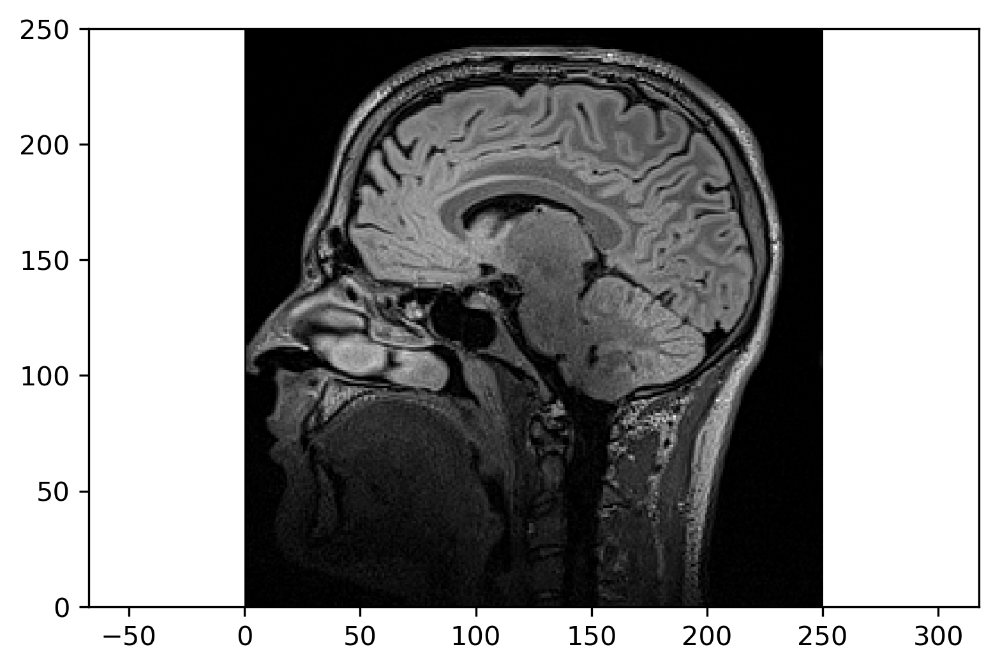
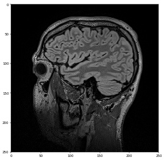
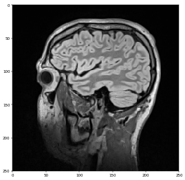
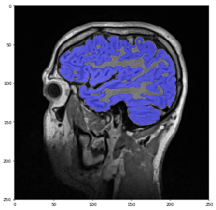
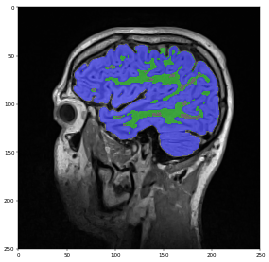

## Medical Image Analysis Project - MR head image

In this programming task, we'll get to work with some sample medical imaging data in the DICOM format and we'll learn how to visualise it and how to do some basic medical image analysis tasks, such as smoothing and segmentation. 


## Part 1: Importing packages needed

*Pydicom* is a Python package for working with DICOM files.  It allows us to read and easily manipulate DICOM files with the use of Python.

ITK (Insight Segmentation and Registration Toolkit) is a library that enables image processing, and it is widely used for the development of image segmentation and image registration programs. Here, we'll use *SimpleITK*, as it is a simplified interface to ITK.

The *OS* module in Python provides a way of using operating system dependent functionality, for instance for working with files and folders.  

*NumPy* is a widely used Python package for working with large, multi-dimensional data (note that here we'll be using it to manipulate pixel data), while *Matplotlib* is a Python library for plotting data. 

Now, lets import the packages. 


```python
import pydicom
import SimpleITK
import os
import numpy
import matplotlib.pyplot as plt
%pylab inline
```

    Populating the interactive namespace from numpy and matplotlib


<br>
## Part 2: Loading the data

In this programming task we're going to be working with a dataset from an MR examination of a patient's head. The images are captured as DICOM files and they are stored in a folder called 'MyHead'.  

Run the code in the following cell to create a list called 'lstFilesDCM', which contains all DICOM files within 'MyHead'. <br>

Remember that you are not expected to understand all the code in this programming task. (If, however, you are really curious, this is what this code does: It first creates a list called 'lstFilesDCM' that is initially empty. It then uses the *os.walk()* function from the OS module to traverse the MyHead folder. For each file found in this folder, we check whether it is a DICOM file, and if it is, we add its extended name (i.e. the folder and file name) to the lstFilesDCM list.)


```python
PathDicom = "data/readonly/MyHead/"
lstFilesDCM = []  # create an empty list
for dirName, subdirList, fileList in os.walk(PathDicom):
    for filename in fileList:
        if ".dcm" in filename.lower():  # check whether the file is DICOM
            lstFilesDCM.append(os.path.join(dirName,filename))
```

Run the code in the following cell to get the first five elements of the 'lstFilesDCM' list, i.e. the extended names of the first five DICOM files.


```python
lstFilesDCM[:5]
```


    ['data/readonly/MyHead/MR000059.dcm',
     'data/readonly/MyHead/MR000080.dcm',
     'data/readonly/MyHead/MR000157.dcm',
     'data/readonly/MyHead/MR000136.dcm',
     'data/readonly/MyHead/MR000009.dcm']


### Reading a DICOM file

Run the code in the following cell to use Pydicom's *read_file()* function to read the first DICOM file within lstFilesDCM (identified as 'lstFilesDCM[0]'). The resulting object is called 'HeadDs'. Note that we could have called it anything we wanted.


```python
HeadDs = pydicom.read_file(lstFilesDCM[0])
```

### Getting metadata

We can now get metadata of interest for this image with the use of appropriate Pydicom functions (e.g. *PatientPosition* or *Modality*).

Run the code in the following cell to get the position of the patient relative to the imaging equipment space.


```python
HeadDs.PatientPosition
```


    'HFS'


*HFS* stands for Head First-Supine. This means that the patient’s head was positioned toward the front of the imaging equipment and it was in an upward direction. 

Run the code in the following cell to get the date the study started. Note that the date format is YYYYMMDD.


```python
HeadDs.StudyDate
```


    '20111110'


Run the code in the following cell to get the image modality. Note that 'MR' stands for Magnetic Resonance, 'CT' stands for Computed Tomography and 'PT' stands for Positron Emission Tomography (PET).


```python
HeadDs.Modality
```


    'MR'


<br>
## Part 3: Visualisation

Now that we've got an idea of the imaging data that we're going to be working with, we'll visualise the data by creating a two-dimensional plot. But first we'll need to extract some additional information needed for plotting.

**Important note**: Remember that you don't need to fully understand the code in this programming task. In fact, you could simply reuse the code in Part 3 for a new collection of MR images, given that you've called the list of your DICOM files 'lstFilesDCM' and the first image 'HeadDs'.

### Preparing for visualisation

In order to plot the data with Matplotlib, we first need to i) combine the pixel data from all DICOM files (i.e. from all slices) into a 3D dataset, and ii) specify appropriate coordinate axes.

We'll start by calculating the total dimensions of the combined 3D dataset. These should be: (Number of pixel rows in a slice) x (Number of pixel columns in a slice) x (Number of slices) along the x, y, and z cartesian axes. We'll call the calculated dimensions 'CalcPixelDims'.


```python
CalcPixelDims = (int(HeadDs.Rows), int(HeadDs.Columns), len(lstFilesDCM))
```

Run the code in the following cell to get CalcPixelDims.


```python
CalcPixelDims
```


    (256, 256, 176)


Now that we've calculated the dimensions, we can create a 3D NumPy array to address the first point discussed above. Note that a NumPy array is understood as a grid of values, all of the same type. 

The following code creates a NumPy array called 'HeadImgArray' that has the same size as CalcPixelDims, and which contains the pixel data from all DICOM files in lstFilesDCM. 


```python
HeadImgArray = numpy.zeros(CalcPixelDims, dtype=HeadDs.pixel_array.dtype)

for filenameDCM in lstFilesDCM:
    ds = pydicom.read_file(filenameDCM)
    HeadImgArray[:, :, lstFilesDCM.index(filenameDCM)] = ds.pixel_array
```

Now that we've addressed the first point, we move on to specify appropriate coordinate axes.

We use Pydicom's *PixelSpacing* and *SliceThickness* functions to calculate the spacing between pixels in the three axes. We call the resulting object 'CalcPixelSpacing'.


```python
CalcPixelSpacing = (float(HeadDs.PixelSpacing[0]), float(HeadDs.PixelSpacing[1]), float(HeadDs.SliceThickness))
```

Then, we use CalcPixelDims and CalcPixelSpacing to calculate coordinate axes. You don't need to understand what this code does. Just run it to compute x, y and z.


```python
x = numpy.arange(0.0, (CalcPixelDims[0]+1)*CalcPixelSpacing[0], CalcPixelSpacing[0])
y = numpy.arange(0.0, (CalcPixelDims[1]+1)*CalcPixelSpacing[1], CalcPixelSpacing[1])
z = numpy.arange(0.0, (CalcPixelDims[2]+1)*CalcPixelSpacing[2], CalcPixelSpacing[2])
```

### Visualising

We can now plot the data with the use of the pyplot module in matplotlib.

Again, you don't need to understand in detail what this code does. You can simply run it to get a plot of the head MR image. Note that you can modify the number in the last line of the code to get a different slice of the head.


```python
plt.figure(dpi=300)
plt.axes().set_aspect('equal', 'datalim')
plt.set_cmap(plt.gray())
plt.pcolormesh(x, y, numpy.flipud(HeadImgArray[:, :, 125]))
```


    <matplotlib.collections.QuadMesh at 0x7f227ccee860>





<br>
## Part 4: Segmentation

In this part of the notebook we'll use SimpleITK to segment the white and grey matter in the MR images.

### Specifying a helper function

We'll be visualising quite a few 2D SimpleITK images in this part, so here we'll define a function that quickly plots a 2D SimpleITK image with a greyscale colourmap and accompanying axes.  

There's no need to understand what this code does - you can simply run it so that you can use the *sitk_show* function later on.


```python
def sitk_show(img, title=None, margin=0.05, dpi=40 ):
    nda = SimpleITK.GetArrayFromImage(img)
    spacing = img.GetSpacing()
    figsize = (1 + margin) * nda.shape[0] / dpi, (1 + margin) * nda.shape[1] / dpi
    extent = (0, nda.shape[1]*spacing[1], nda.shape[0]*spacing[0], 0)
    fig = plt.figure(figsize=figsize, dpi=dpi)
    ax = fig.add_axes([margin, margin, 1 - 2*margin, 1 - 2*margin])

    plt.set_cmap("gray")
    ax.imshow(nda,extent=extent,interpolation=None)
    
    if title:
        plt.title(title)
    
    plt.show()
```

### Loading the data in SimpleITK

We now need to tell SimpleITK to read the DICOM files within the 'MyHead' folder. Run the code in the following cell to extract the contents of the MRI dataset and create the corresponding 3D image called 'img3DOriginal'. 

Note that you don't need to understand what this code does. You can simply run it, so as to use img3DOriginal later on.  You can also reuse this code for a new collection of MR images, given that you've called the location of your DICOM files 'PathDicom'.


```python
reader = SimpleITK.ImageSeriesReader()
filenamesDICOM = reader.GetGDCMSeriesFileNames(PathDicom)
reader.SetFileNames(filenamesDICOM)
img3DOriginal = reader.Execute()
```

In order to keep things simple, we'll segment a 2D slice of the 3D image (rather than the entire 3D image). Run the code below to specify that we want Z-slice 50 of the 3D image. We'll call this slice 'imgOriginal'.

Note that you could ask for a different Z-slice, if you want.


```python
imgOriginal = img3DOriginal[:,:,50]
```

### Visualising the original data

We'll now call our *sitk_show* function to visualise the original data. 


```python
sitk_show(imgOriginal)
```





### Smoothing

Smoothing is the process of reducing noise within an image or producing a less pixelated image.  The result is an image with sharp edges or boundaries preserved and smoothing occurring only within a region.

In our case, we can see that the original image data exhibits quite a bit of noise, which is rather typical of MRI datasets. We will reduce the noise, so as to ease the process of segmentation later on.

Run the code in the following cell to apply a Curvature Flow Image Filter to smoothen *imgOriginal*. We'll call the resulting image 'imgSmooth'.


```python
imgSmooth = SimpleITK.CurvatureFlow(image1=imgOriginal,
                                    timeStep=0.125,
                                    numberOfIterations=5)
```

Now, lets see the results of the smoothened image.


```python
sitk_show(imgSmooth)
```





### Segmentation with the ConnectedThreshold filter

We will now apply region growing techniques to segment the white and grey matter of the smoothened image.

#### Initial segmentation of the white matter

Run the code in the following cell to apply SimpleITK's *ConnectedThreshold* filter function to imgSmooth. The image of the resulting segmented white matter is called 'imgWhiteMatter'.

As with other parts of this programming task, you don't need to fully understand what this code does. You can simply run it to get the initial segmentation of the white matter. 

If, however, you're really curious, here's a brief explanation: This filter starts from a seed point in the image that we know is white matter, and looks at all connected pixels. If their values lie within a range of interest, then they are labelled as white matter. In our case, we've set the seed to be point (150, 75), as by inspecting the previous image, it looked like that point was indeed white matter. We've also set the range of values to be between 130 and 190, as these were roughly the values that the white matter pixels exhibited (this was inspected with the use of a separate DICOM viewing software).


```python
lstSeeds = [(150,75)]

imgWhiteMatter = SimpleITK.ConnectedThreshold(image1=imgSmooth, 
                                              seedList=lstSeeds, 
                                              lower=130, 
                                              upper=190,
                                              replaceValue=1)
```

Next, we want to view the result of the segmentation. If we tried to visualise imgWhiteMatter, then all we would see would be a white-colour label in a black backdrop, which doesn’t give us much insight.  However, if we use a label overlay, then we can see the result of the segmentation of white matter in a basic RGB (red, green, blue) colour. In our case, it will show as green. 

Note that before overlaying imgSmooth and imgWhiteMatter, we first need to manipulate imgSmooth so we can successfully mix the two images. This is what the following code does. The resulting image is called 'imgSmoothInt'.


```python
imgSmoothInt = SimpleITK.Cast(SimpleITK.RescaleIntensity(imgSmooth), imgWhiteMatter.GetPixelID())
```

Now let's use SimpleITK's *LabelOverlay* function to overlay 'imgSmoothInt' and 'imgWhiteMatter', and let's visualise the result.


```python
sitk_show(SimpleITK.LabelOverlay(imgSmoothInt, imgWhiteMatter))
```


#### Hole-filling of the segmented white matter

As you can see in the figure above, there are several holes in the segmented white matter. We'll rectify this by applying hole-filling.  

Run the code in the following cell to use SimpleITK's *VotingBinaryHoleFilling* filter to fill in holes in *imgWhiteMatter*.  The resulting image is called 'imgWhiteMatterNoHoles'.


```python
imgWhiteMatterNoHoles = SimpleITK.VotingBinaryHoleFilling(image1=imgWhiteMatter,
                                                          radius=[2]*3,
                                                          majorityThreshold=1,
                                                          backgroundValue=0,
                                                          foregroundValue=1)
```

Now let's use SimpleITK's *LabelOverlay* function to overlay 'imgSmoothInt' and the newly obtained 'imgWhiteMatterNoHoles', and let's visualise the result.


```python
sitk_show(SimpleITK.LabelOverlay(imgSmoothInt, imgWhiteMatterNoHoles))
```


#### Segmentation and hole-filling of grey matter

We'll now repeat the process for grey matter. In other words, we'll do some preliminary segmentation and then we'll perform hole-filling of the segmented grey matter. We'll then overlay the 'imgSmoothInt' and the 'imgGreyMatterNoHoles' images and we'll visualise the result.


```python
lstSeeds = [(119, 83), (198, 80), (185, 102), (164, 43)]

imgGreyMatter = SimpleITK.ConnectedThreshold(image1=imgSmooth, 
                                             seedList=lstSeeds, 
                                             lower=150, 
                                             upper=270,
                                             replaceValue=2)

imgGreyMatterNoHoles = SimpleITK.VotingBinaryHoleFilling(image1=imgGreyMatter,
                                                         radius=[2]*3,
                                                         majorityThreshold=1,
                                                         backgroundValue=0,
                                                         foregroundValue=2) # labelGrayMatter

sitk_show(SimpleITK.LabelOverlay(imgSmoothInt, imgGreyMatterNoHoles))
```





#### Combining the white and grey matter

Lastly, we want to combine the two label-fields, in other words, the white and grey matter.  We do this by running the code below, with the results being stored under 'imgLabels'.   


```python
imgLabels = imgWhiteMatterNoHoles | imgGreyMatterNoHoles
```

Now let's use SimpleITK's *LabelOverlay* function to overlay 'imgSmoothInt' and the newly obtained 'imgLabels', and let's visualise the result.


```python
sitk_show(SimpleITK.LabelOverlay(imgSmoothInt, imgLabels))
```


Note that the cyan-coloured label are regions where both the white matter and grey matter overlap from the initial segmentation process above.  

The majority of those regions should actually be part of the grey matter. Run the code in the following cell to fix this, with the results being stored under 'imgLabels2'. Note that you don't need to understand in detail what the code does. All you need to know is that it assigns any overlapping regions to the grey matter.


```python
imgMask = (imgWhiteMatterNoHoles/1) * (imgGreyMatterNoHoles/2)
imgMask2 = SimpleITK.Cast(imgMask, imgWhiteMatterNoHoles.GetPixelIDValue())
imgWhiteMatterNoHoles = imgWhiteMatterNoHoles - (imgMask2*1)
imgLabels2 = imgWhiteMatterNoHoles + imgGreyMatterNoHoles
```

Now let's use SimpleITK's *LabelOverlay* function to overlay 'imgSmoothInt' and the newly obtained 'imgLabels2', and let's visualise the result.


```python
sitk_show(SimpleITK.LabelOverlay(imgSmoothInt, imgLabels2))
```





And that's it! You've now had a taste of medical image processing!


