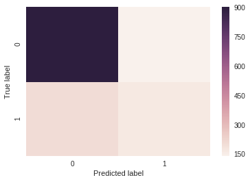
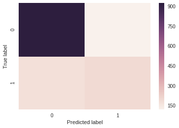

## Customer Churn Prediction In A Telecommunications Company

## Use Case

In this project, we will create a model to predict customer churning (leaving) of a telecommunications company based on the data set containing details like customer demographics, their behaviour, and whether they end up churning. 

### Importing the Necessary Libraries


```python
# Import Libraries
import pandas as pd
import numpy as np
import matplotlib.pyplot as plt
import seaborn as sns
% matplotlib inline
from sklearn.model_selection import train_test_split
from sklearn.metrics import accuracy_score

```

## Data Set

### Data Description
The data set down loaded from watson analytics and can be dwonloaded from the belo link.  
[Down load data]("https://community.watsonanalytics.com/wp-content/uploads/2015/03/WA_Fn-UseC_-Telco-Customer-Churn.csv")


Dataset on customer demographics, their behaviour, and whether or not they end up churning (leaving). This data set provides info to help you predict behavior to retain customers. You can analyze all relevant customer data and develop focused customer retention programs. A telecommunications company is concerned about the number of customers leaving their landline business for cable competitors. They need to understand who is leaving. Imagine that you’re an analyst at this company and you have to find out who is leaving and why.

* The data set on customer churn includes information about:

* Customers who left within the last month – the column is called Churn

* Services that each customer has signed up for phone, multiple lines, internet, online security, online backup, - device      protection, tech support, and streaming TV and movies

* Customer account information- How long they’ve been a customer (tenure), contract, payment method, paperless billing, monthly charges, and total charges

* Demographic info about customers - gender, age range, and if they have partners and dependents


### Creating a Pandas DataFrame from a CSV file


```python
data = pd.read_csv("custchurn.csv")
```

## Data Wrangling


```python
data.head(3)
```


<div>
<style>
    .dataframe thead tr:only-child th {
        text-align: right;
    }

    .dataframe thead th {
        text-align: left;
    }

    .dataframe tbody tr th {
        vertical-align: top;
    }
</style>
<table border="1" class="dataframe">
  <thead>
    <tr style="text-align: right;">
      <th></th>
      <th>customerID</th>
      <th>gender</th>
      <th>SeniorCitizen</th>
      <th>Partner</th>
      <th>Dependents</th>
      <th>tenure</th>
      <th>PhoneService</th>
      <th>MultipleLines</th>
      <th>InternetService</th>
      <th>OnlineSecurity</th>
      <th>...</th>
      <th>DeviceProtection</th>
      <th>TechSupport</th>
      <th>StreamingTV</th>
      <th>StreamingMovies</th>
      <th>Contract</th>
      <th>PaperlessBilling</th>
      <th>PaymentMethod</th>
      <th>MonthlyCharges</th>
      <th>TotalCharges</th>
      <th>Churn</th>
    </tr>
  </thead>
  <tbody>
    <tr>
      <th>0</th>
      <td>7590-VHVEG</td>
      <td>Female</td>
      <td>0</td>
      <td>Yes</td>
      <td>No</td>
      <td>1</td>
      <td>No</td>
      <td>No phone service</td>
      <td>DSL</td>
      <td>No</td>
      <td>...</td>
      <td>No</td>
      <td>No</td>
      <td>No</td>
      <td>No</td>
      <td>Month-to-month</td>
      <td>Yes</td>
      <td>Electronic check</td>
      <td>29.85</td>
      <td>29.85</td>
      <td>No</td>
    </tr>
    <tr>
      <th>1</th>
      <td>5575-GNVDE</td>
      <td>Male</td>
      <td>0</td>
      <td>No</td>
      <td>No</td>
      <td>34</td>
      <td>Yes</td>
      <td>No</td>
      <td>DSL</td>
      <td>Yes</td>
      <td>...</td>
      <td>Yes</td>
      <td>No</td>
      <td>No</td>
      <td>No</td>
      <td>One year</td>
      <td>No</td>
      <td>Mailed check</td>
      <td>56.95</td>
      <td>1889.5</td>
      <td>No</td>
    </tr>
    <tr>
      <th>2</th>
      <td>3668-QPYBK</td>
      <td>Male</td>
      <td>0</td>
      <td>No</td>
      <td>No</td>
      <td>2</td>
      <td>Yes</td>
      <td>No</td>
      <td>DSL</td>
      <td>Yes</td>
      <td>...</td>
      <td>No</td>
      <td>No</td>
      <td>No</td>
      <td>No</td>
      <td>Month-to-month</td>
      <td>Yes</td>
      <td>Mailed check</td>
      <td>53.85</td>
      <td>108.15</td>
      <td>Yes</td>
    </tr>
  </tbody>
</table>
<p>3 rows × 21 columns</p>
</div>


```python
data.shape
```


    (7043, 21)


```python
data.columns
```


    Index(['customerID', 'gender', 'SeniorCitizen', 'Partner', 'Dependents',
           'tenure', 'PhoneService', 'MultipleLines', 'InternetService',
           'OnlineSecurity', 'OnlineBackup', 'DeviceProtection', 'TechSupport',
           'StreamingTV', 'StreamingMovies', 'Contract', 'PaperlessBilling',
           'PaymentMethod', 'MonthlyCharges', 'TotalCharges', 'Churn'],
          dtype='object')


```python
data.describe(include='all').T
```


<div>
<style>
    .dataframe thead tr:only-child th {
        text-align: right;
    }

    .dataframe thead th {
        text-align: left;
    }

    .dataframe tbody tr th {
        vertical-align: top;
    }
</style>
<table border="1" class="dataframe">
  <thead>
    <tr style="text-align: right;">
      <th></th>
      <th>count</th>
      <th>unique</th>
      <th>top</th>
      <th>freq</th>
      <th>mean</th>
      <th>std</th>
      <th>min</th>
      <th>25%</th>
      <th>50%</th>
      <th>75%</th>
      <th>max</th>
    </tr>
  </thead>
  <tbody>
    <tr>
      <th>customerID</th>
      <td>7043</td>
      <td>7043</td>
      <td>7881-INRLC</td>
      <td>1</td>
      <td>NaN</td>
      <td>NaN</td>
      <td>NaN</td>
      <td>NaN</td>
      <td>NaN</td>
      <td>NaN</td>
      <td>NaN</td>
    </tr>
    <tr>
      <th>gender</th>
      <td>7043</td>
      <td>2</td>
      <td>Male</td>
      <td>3555</td>
      <td>NaN</td>
      <td>NaN</td>
      <td>NaN</td>
      <td>NaN</td>
      <td>NaN</td>
      <td>NaN</td>
      <td>NaN</td>
    </tr>
    <tr>
      <th>SeniorCitizen</th>
      <td>7043</td>
      <td>NaN</td>
      <td>NaN</td>
      <td>NaN</td>
      <td>0.162147</td>
      <td>0.368612</td>
      <td>0</td>
      <td>0</td>
      <td>0</td>
      <td>0</td>
      <td>1</td>
    </tr>
    <tr>
      <th>Partner</th>
      <td>7043</td>
      <td>2</td>
      <td>No</td>
      <td>3641</td>
      <td>NaN</td>
      <td>NaN</td>
      <td>NaN</td>
      <td>NaN</td>
      <td>NaN</td>
      <td>NaN</td>
      <td>NaN</td>
    </tr>
    <tr>
      <th>Dependents</th>
      <td>7043</td>
      <td>2</td>
      <td>No</td>
      <td>4933</td>
      <td>NaN</td>
      <td>NaN</td>
      <td>NaN</td>
      <td>NaN</td>
      <td>NaN</td>
      <td>NaN</td>
      <td>NaN</td>
    </tr>
    <tr>
      <th>tenure</th>
      <td>7043</td>
      <td>NaN</td>
      <td>NaN</td>
      <td>NaN</td>
      <td>32.3711</td>
      <td>24.5595</td>
      <td>0</td>
      <td>9</td>
      <td>29</td>
      <td>55</td>
      <td>72</td>
    </tr>
    <tr>
      <th>PhoneService</th>
      <td>7043</td>
      <td>2</td>
      <td>Yes</td>
      <td>6361</td>
      <td>NaN</td>
      <td>NaN</td>
      <td>NaN</td>
      <td>NaN</td>
      <td>NaN</td>
      <td>NaN</td>
      <td>NaN</td>
    </tr>
    <tr>
      <th>MultipleLines</th>
      <td>7043</td>
      <td>3</td>
      <td>No</td>
      <td>3390</td>
      <td>NaN</td>
      <td>NaN</td>
      <td>NaN</td>
      <td>NaN</td>
      <td>NaN</td>
      <td>NaN</td>
      <td>NaN</td>
    </tr>
    <tr>
      <th>InternetService</th>
      <td>7043</td>
      <td>3</td>
      <td>Fiber optic</td>
      <td>3096</td>
      <td>NaN</td>
      <td>NaN</td>
      <td>NaN</td>
      <td>NaN</td>
      <td>NaN</td>
      <td>NaN</td>
      <td>NaN</td>
    </tr>
    <tr>
      <th>OnlineSecurity</th>
      <td>7043</td>
      <td>3</td>
      <td>No</td>
      <td>3498</td>
      <td>NaN</td>
      <td>NaN</td>
      <td>NaN</td>
      <td>NaN</td>
      <td>NaN</td>
      <td>NaN</td>
      <td>NaN</td>
    </tr>
    <tr>
      <th>OnlineBackup</th>
      <td>7043</td>
      <td>3</td>
      <td>No</td>
      <td>3088</td>
      <td>NaN</td>
      <td>NaN</td>
      <td>NaN</td>
      <td>NaN</td>
      <td>NaN</td>
      <td>NaN</td>
      <td>NaN</td>
    </tr>
    <tr>
      <th>DeviceProtection</th>
      <td>7043</td>
      <td>3</td>
      <td>No</td>
      <td>3095</td>
      <td>NaN</td>
      <td>NaN</td>
      <td>NaN</td>
      <td>NaN</td>
      <td>NaN</td>
      <td>NaN</td>
      <td>NaN</td>
    </tr>
    <tr>
      <th>TechSupport</th>
      <td>7043</td>
      <td>3</td>
      <td>No</td>
      <td>3473</td>
      <td>NaN</td>
      <td>NaN</td>
      <td>NaN</td>
      <td>NaN</td>
      <td>NaN</td>
      <td>NaN</td>
      <td>NaN</td>
    </tr>
    <tr>
      <th>StreamingTV</th>
      <td>7043</td>
      <td>3</td>
      <td>No</td>
      <td>2810</td>
      <td>NaN</td>
      <td>NaN</td>
      <td>NaN</td>
      <td>NaN</td>
      <td>NaN</td>
      <td>NaN</td>
      <td>NaN</td>
    </tr>
    <tr>
      <th>StreamingMovies</th>
      <td>7043</td>
      <td>3</td>
      <td>No</td>
      <td>2785</td>
      <td>NaN</td>
      <td>NaN</td>
      <td>NaN</td>
      <td>NaN</td>
      <td>NaN</td>
      <td>NaN</td>
      <td>NaN</td>
    </tr>
    <tr>
      <th>Contract</th>
      <td>7043</td>
      <td>3</td>
      <td>Month-to-month</td>
      <td>3875</td>
      <td>NaN</td>
      <td>NaN</td>
      <td>NaN</td>
      <td>NaN</td>
      <td>NaN</td>
      <td>NaN</td>
      <td>NaN</td>
    </tr>
    <tr>
      <th>PaperlessBilling</th>
      <td>7043</td>
      <td>2</td>
      <td>Yes</td>
      <td>4171</td>
      <td>NaN</td>
      <td>NaN</td>
      <td>NaN</td>
      <td>NaN</td>
      <td>NaN</td>
      <td>NaN</td>
      <td>NaN</td>
    </tr>
    <tr>
      <th>PaymentMethod</th>
      <td>7043</td>
      <td>4</td>
      <td>Electronic check</td>
      <td>2365</td>
      <td>NaN</td>
      <td>NaN</td>
      <td>NaN</td>
      <td>NaN</td>
      <td>NaN</td>
      <td>NaN</td>
      <td>NaN</td>
    </tr>
    <tr>
      <th>MonthlyCharges</th>
      <td>7043</td>
      <td>NaN</td>
      <td>NaN</td>
      <td>NaN</td>
      <td>64.7617</td>
      <td>30.09</td>
      <td>18.25</td>
      <td>35.5</td>
      <td>70.35</td>
      <td>89.85</td>
      <td>118.75</td>
    </tr>
    <tr>
      <th>TotalCharges</th>
      <td>7043</td>
      <td>6531</td>
      <td></td>
      <td>11</td>
      <td>NaN</td>
      <td>NaN</td>
      <td>NaN</td>
      <td>NaN</td>
      <td>NaN</td>
      <td>NaN</td>
      <td>NaN</td>
    </tr>
    <tr>
      <th>Churn</th>
      <td>7043</td>
      <td>2</td>
      <td>No</td>
      <td>5174</td>
      <td>NaN</td>
      <td>NaN</td>
      <td>NaN</td>
      <td>NaN</td>
      <td>NaN</td>
      <td>NaN</td>
      <td>NaN</td>
    </tr>
  </tbody>
</table>
</div>


```python
data.info()
```

    <class 'pandas.core.frame.DataFrame'>
    RangeIndex: 7043 entries, 0 to 7042
    Data columns (total 21 columns):
    customerID          7043 non-null object
    gender              7043 non-null object
    SeniorCitizen       7043 non-null int64
    Partner             7043 non-null object
    Dependents          7043 non-null object
    tenure              7043 non-null int64
    PhoneService        7043 non-null object
    MultipleLines       7043 non-null object
    InternetService     7043 non-null object
    OnlineSecurity      7043 non-null object
    OnlineBackup        7043 non-null object
    DeviceProtection    7043 non-null object
    TechSupport         7043 non-null object
    StreamingTV         7043 non-null object
    StreamingMovies     7043 non-null object
    Contract            7043 non-null object
    PaperlessBilling    7043 non-null object
    PaymentMethod       7043 non-null object
    MonthlyCharges      7043 non-null float64
    TotalCharges        7043 non-null object
    Churn               7043 non-null object
    dtypes: float64(1), int64(2), object(18)
    memory usage: 1.1+ MB


```python
data.isnull().sum()
```


    customerID          0
    gender              0
    SeniorCitizen       0
    Partner             0
    Dependents          0
    tenure              0
    PhoneService        0
    MultipleLines       0
    InternetService     0
    OnlineSecurity      0
    OnlineBackup        0
    DeviceProtection    0
    TechSupport         0
    StreamingTV         0
    StreamingMovies     0
    Contract            0
    PaperlessBilling    0
    PaymentMethod       0
    MonthlyCharges      0
    TotalCharges        0
    Churn               0
    dtype: int64


### Data Cleaning

Categorize columns 'MonthlyCharges' and 'TotalCharges'


```python
data["MonthlyCharges_cat"] = (data['MonthlyCharges'] > np.mean(data['MonthlyCharges'])) *1

```

'TotalCharges' is object data type. So we have to convert to numeric data type and then categorize. Also some rows containing missing values as ' '  character. So we need to replace these rows with 'nan' and then fill  with '0'.


```python
data["TotalCharges"][488]
```


    ' '


```python
data_clean = data.replace(' ', np.nan)
```


```python
data_clean["TotalCharges"][488]
```


    nan


```python
data_clean.isnull().sum()
```


    customerID             0
    gender                 0
    SeniorCitizen          0
    Partner                0
    Dependents             0
    tenure                 0
    PhoneService           0
    MultipleLines          0
    InternetService        0
    OnlineSecurity         0
    OnlineBackup           0
    DeviceProtection       0
    TechSupport            0
    StreamingTV            0
    StreamingMovies        0
    Contract               0
    PaperlessBilling       0
    PaymentMethod          0
    MonthlyCharges         0
    TotalCharges          11
    Churn                  0
    MonthlyCharges_cat     0
    dtype: int64


```python
data_clean_1 = data_clean.fillna(0)
```


```python
data_clean_1["TotalCharges_num"] = data_clean_1["TotalCharges"].astype(np.float64)

```


```python
data_clean_1.head(3)
```


<div>
<style>
    .dataframe thead tr:only-child th {
        text-align: right;
    }

    .dataframe thead th {
        text-align: left;
    }

    .dataframe tbody tr th {
        vertical-align: top;
    }
</style>
<table border="1" class="dataframe">
  <thead>
    <tr style="text-align: right;">
      <th></th>
      <th>customerID</th>
      <th>gender</th>
      <th>SeniorCitizen</th>
      <th>Partner</th>
      <th>Dependents</th>
      <th>tenure</th>
      <th>PhoneService</th>
      <th>MultipleLines</th>
      <th>InternetService</th>
      <th>OnlineSecurity</th>
      <th>...</th>
      <th>StreamingTV</th>
      <th>StreamingMovies</th>
      <th>Contract</th>
      <th>PaperlessBilling</th>
      <th>PaymentMethod</th>
      <th>MonthlyCharges</th>
      <th>TotalCharges</th>
      <th>Churn</th>
      <th>MonthlyCharges_cat</th>
      <th>TotalCharges_num</th>
    </tr>
  </thead>
  <tbody>
    <tr>
      <th>0</th>
      <td>7590-VHVEG</td>
      <td>Female</td>
      <td>0</td>
      <td>Yes</td>
      <td>No</td>
      <td>1</td>
      <td>No</td>
      <td>No phone service</td>
      <td>DSL</td>
      <td>No</td>
      <td>...</td>
      <td>No</td>
      <td>No</td>
      <td>Month-to-month</td>
      <td>Yes</td>
      <td>Electronic check</td>
      <td>29.85</td>
      <td>29.85</td>
      <td>No</td>
      <td>0</td>
      <td>29.85</td>
    </tr>
    <tr>
      <th>1</th>
      <td>5575-GNVDE</td>
      <td>Male</td>
      <td>0</td>
      <td>No</td>
      <td>No</td>
      <td>34</td>
      <td>Yes</td>
      <td>No</td>
      <td>DSL</td>
      <td>Yes</td>
      <td>...</td>
      <td>No</td>
      <td>No</td>
      <td>One year</td>
      <td>No</td>
      <td>Mailed check</td>
      <td>56.95</td>
      <td>1889.5</td>
      <td>No</td>
      <td>0</td>
      <td>1889.50</td>
    </tr>
    <tr>
      <th>2</th>
      <td>3668-QPYBK</td>
      <td>Male</td>
      <td>0</td>
      <td>No</td>
      <td>No</td>
      <td>2</td>
      <td>Yes</td>
      <td>No</td>
      <td>DSL</td>
      <td>Yes</td>
      <td>...</td>
      <td>No</td>
      <td>No</td>
      <td>Month-to-month</td>
      <td>Yes</td>
      <td>Mailed check</td>
      <td>53.85</td>
      <td>108.15</td>
      <td>Yes</td>
      <td>0</td>
      <td>108.15</td>
    </tr>
  </tbody>
</table>
<p>3 rows × 23 columns</p>
</div>


```python
data_clean_1["TotalCharges_cat"] = (data_clean_1['TotalCharges_num'] > np.mean(data_clean_1['TotalCharges_num'])) *1
```


```python
data_clean_1.head()
```


<div>
<style>
    .dataframe thead tr:only-child th {
        text-align: right;
    }

    .dataframe thead th {
        text-align: left;
    }

    .dataframe tbody tr th {
        vertical-align: top;
    }
</style>
<table border="1" class="dataframe">
  <thead>
    <tr style="text-align: right;">
      <th></th>
      <th>customerID</th>
      <th>gender</th>
      <th>SeniorCitizen</th>
      <th>Partner</th>
      <th>Dependents</th>
      <th>tenure</th>
      <th>PhoneService</th>
      <th>MultipleLines</th>
      <th>InternetService</th>
      <th>OnlineSecurity</th>
      <th>...</th>
      <th>StreamingMovies</th>
      <th>Contract</th>
      <th>PaperlessBilling</th>
      <th>PaymentMethod</th>
      <th>MonthlyCharges</th>
      <th>TotalCharges</th>
      <th>Churn</th>
      <th>MonthlyCharges_cat</th>
      <th>TotalCharges_num</th>
      <th>TotalCharges_cat</th>
    </tr>
  </thead>
  <tbody>
    <tr>
      <th>0</th>
      <td>7590-VHVEG</td>
      <td>Female</td>
      <td>0</td>
      <td>Yes</td>
      <td>No</td>
      <td>1</td>
      <td>No</td>
      <td>No phone service</td>
      <td>DSL</td>
      <td>No</td>
      <td>...</td>
      <td>No</td>
      <td>Month-to-month</td>
      <td>Yes</td>
      <td>Electronic check</td>
      <td>29.85</td>
      <td>29.85</td>
      <td>No</td>
      <td>0</td>
      <td>29.85</td>
      <td>0</td>
    </tr>
    <tr>
      <th>1</th>
      <td>5575-GNVDE</td>
      <td>Male</td>
      <td>0</td>
      <td>No</td>
      <td>No</td>
      <td>34</td>
      <td>Yes</td>
      <td>No</td>
      <td>DSL</td>
      <td>Yes</td>
      <td>...</td>
      <td>No</td>
      <td>One year</td>
      <td>No</td>
      <td>Mailed check</td>
      <td>56.95</td>
      <td>1889.5</td>
      <td>No</td>
      <td>0</td>
      <td>1889.50</td>
      <td>0</td>
    </tr>
    <tr>
      <th>2</th>
      <td>3668-QPYBK</td>
      <td>Male</td>
      <td>0</td>
      <td>No</td>
      <td>No</td>
      <td>2</td>
      <td>Yes</td>
      <td>No</td>
      <td>DSL</td>
      <td>Yes</td>
      <td>...</td>
      <td>No</td>
      <td>Month-to-month</td>
      <td>Yes</td>
      <td>Mailed check</td>
      <td>53.85</td>
      <td>108.15</td>
      <td>Yes</td>
      <td>0</td>
      <td>108.15</td>
      <td>0</td>
    </tr>
    <tr>
      <th>3</th>
      <td>7795-CFOCW</td>
      <td>Male</td>
      <td>0</td>
      <td>No</td>
      <td>No</td>
      <td>45</td>
      <td>No</td>
      <td>No phone service</td>
      <td>DSL</td>
      <td>Yes</td>
      <td>...</td>
      <td>No</td>
      <td>One year</td>
      <td>No</td>
      <td>Bank transfer (automatic)</td>
      <td>42.30</td>
      <td>1840.75</td>
      <td>No</td>
      <td>0</td>
      <td>1840.75</td>
      <td>0</td>
    </tr>
    <tr>
      <th>4</th>
      <td>9237-HQITU</td>
      <td>Female</td>
      <td>0</td>
      <td>No</td>
      <td>No</td>
      <td>2</td>
      <td>Yes</td>
      <td>No</td>
      <td>Fiber optic</td>
      <td>No</td>
      <td>...</td>
      <td>No</td>
      <td>Month-to-month</td>
      <td>Yes</td>
      <td>Electronic check</td>
      <td>70.70</td>
      <td>151.65</td>
      <td>Yes</td>
      <td>1</td>
      <td>151.65</td>
      <td>0</td>
    </tr>
  </tbody>
</table>
<p>5 rows × 24 columns</p>
</div>


```python
data_clean_1.info()
```

    <class 'pandas.core.frame.DataFrame'>
    RangeIndex: 7043 entries, 0 to 7042
    Data columns (total 24 columns):
    customerID            7043 non-null object
    gender                7043 non-null object
    SeniorCitizen         7043 non-null int64
    Partner               7043 non-null object
    Dependents            7043 non-null object
    tenure                7043 non-null int64
    PhoneService          7043 non-null object
    MultipleLines         7043 non-null object
    InternetService       7043 non-null object
    OnlineSecurity        7043 non-null object
    OnlineBackup          7043 non-null object
    DeviceProtection      7043 non-null object
    TechSupport           7043 non-null object
    StreamingTV           7043 non-null object
    StreamingMovies       7043 non-null object
    Contract              7043 non-null object
    PaperlessBilling      7043 non-null object
    PaymentMethod         7043 non-null object
    MonthlyCharges        7043 non-null float64
    TotalCharges          7043 non-null object
    Churn                 7043 non-null object
    MonthlyCharges_cat    7043 non-null int64
    TotalCharges_num      7043 non-null float64
    TotalCharges_cat      7043 non-null int64
    dtypes: float64(2), int64(4), object(18)
    memory usage: 1.3+ MB


## Exploratory Data Analysis

We will drop columns like "customerID", "MonthlyCharges", "TotalCharges", "TotalCharges_num" as it not required for analysis and modeling.


```python
df = data_clean_1.drop(["customerID", "MonthlyCharges", "TotalCharges", "TotalCharges_num"], axis=1)
df.head(3)
```


<div>
<style>
    .dataframe thead tr:only-child th {
        text-align: right;
    }

    .dataframe thead th {
        text-align: left;
    }

    .dataframe tbody tr th {
        vertical-align: top;
    }
</style>
<table border="1" class="dataframe">
  <thead>
    <tr style="text-align: right;">
      <th></th>
      <th>gender</th>
      <th>SeniorCitizen</th>
      <th>Partner</th>
      <th>Dependents</th>
      <th>tenure</th>
      <th>PhoneService</th>
      <th>MultipleLines</th>
      <th>InternetService</th>
      <th>OnlineSecurity</th>
      <th>OnlineBackup</th>
      <th>DeviceProtection</th>
      <th>TechSupport</th>
      <th>StreamingTV</th>
      <th>StreamingMovies</th>
      <th>Contract</th>
      <th>PaperlessBilling</th>
      <th>PaymentMethod</th>
      <th>Churn</th>
      <th>MonthlyCharges_cat</th>
      <th>TotalCharges_cat</th>
    </tr>
  </thead>
  <tbody>
    <tr>
      <th>0</th>
      <td>Female</td>
      <td>0</td>
      <td>Yes</td>
      <td>No</td>
      <td>1</td>
      <td>No</td>
      <td>No phone service</td>
      <td>DSL</td>
      <td>No</td>
      <td>Yes</td>
      <td>No</td>
      <td>No</td>
      <td>No</td>
      <td>No</td>
      <td>Month-to-month</td>
      <td>Yes</td>
      <td>Electronic check</td>
      <td>No</td>
      <td>0</td>
      <td>0</td>
    </tr>
    <tr>
      <th>1</th>
      <td>Male</td>
      <td>0</td>
      <td>No</td>
      <td>No</td>
      <td>34</td>
      <td>Yes</td>
      <td>No</td>
      <td>DSL</td>
      <td>Yes</td>
      <td>No</td>
      <td>Yes</td>
      <td>No</td>
      <td>No</td>
      <td>No</td>
      <td>One year</td>
      <td>No</td>
      <td>Mailed check</td>
      <td>No</td>
      <td>0</td>
      <td>0</td>
    </tr>
    <tr>
      <th>2</th>
      <td>Male</td>
      <td>0</td>
      <td>No</td>
      <td>No</td>
      <td>2</td>
      <td>Yes</td>
      <td>No</td>
      <td>DSL</td>
      <td>Yes</td>
      <td>Yes</td>
      <td>No</td>
      <td>No</td>
      <td>No</td>
      <td>No</td>
      <td>Month-to-month</td>
      <td>Yes</td>
      <td>Mailed check</td>
      <td>Yes</td>
      <td>0</td>
      <td>0</td>
    </tr>
  </tbody>
</table>
</div>


### Chi-square Test of Independence using scipy.stats.chi2_contingency

We will check the relation ship of depndent variabel "Churn" against all other independent variables in the data set


The first value  is the Chi-square value, followed by the p-value , then comes the degrees of freedom, and lastly it outputs the expected frequencies as an array. if all of the expected frequencies are greater than 5, the chi2 test results can be trusted. We can reject the null hypothesis as the p-value is less than 0.05. 


```python
import scipy.stats as stats
from scipy.stats import chi2_contingency

```


```python
chi2_contingency(pd.crosstab(df['Churn'], df['gender']))
```


    (0.48408288220913831,
     0.48657873605618596,
     1,
     array([[ 2562.38989067,  2611.61010933],
            [  925.61010933,   943.38989067]]))


```python
chi2_contingency(pd.crosstab(df['Churn'], df['SeniorCitizen']))
```


    (159.42630036838742,
     1.5100668050923778e-36,
     1,
     array([[ 4335.05239245,   838.94760755],
            [ 1565.94760755,   303.05239245]]))


```python
chi2_contingency(pd.crosstab(df['Churn'], df['Partner']))
```


    (158.7333820309922,
     2.1399113440759935e-36,
     1,
     array([[ 2674.78830044,  2499.21169956],
            [  966.21169956,   902.78830044]]))


```python
chi2_contingency(pd.crosstab(df['Churn'], df['Dependents']))
```


    (189.12924940423474,
     4.9249216612154196e-43,
     1,
     array([[ 3623.93042737,  1550.06957263],
            [ 1309.06957263,   559.93042737]]))


```python
chi2_contingency(pd.crosstab(df['Churn'], df['tenure']))
```


    (1065.3308567510544,
     1.2807811055496877e-176,
     72,
     array([[   8.08093142,  450.3282692 ,  174.84197075,  146.92602584,
              129.29490274,   97.70580718,   80.80931421,   96.23654693,
               90.35950589,   87.42098538,   85.21709499,   72.72838279,
               85.95172512,   80.07468408,   55.83188982,   72.72838279,
               58.77041034,   63.91282124,   71.25912253,   53.62799943,
               52.15873917,   46.28169814,   66.11671163,   62.44356098,
               69.05523215,   58.03578021,   58.03578021,   52.8933693 ,
               41.87391736,   52.8933693 ,   52.8933693 ,   47.7509584 ,
               50.68947892,   47.01632827,   47.7509584 ,   64.64745137,
               36.73150646,   47.7509584 ,   43.34317762,   41.13928724,
               47.01632827,   51.42410904,   47.7509584 ,   47.7509584 ,
               37.46613659,   44.81243788,   54.36262956,   49.95484879,
               47.01632827,   48.48558853,   49.95484879,   49.95484879,
               58.77041034,   51.42410904,   49.95484879,   47.01632827,
               58.77041034,   47.7509584 ,   49.22021866,   44.07780775,
               55.83188982,   55.83188982,   51.42410904,   52.8933693 ,
               58.77041034,   55.83188982,   65.3820815 ,   71.99375266,
               73.46301292,   69.78986227,   87.42098538,  124.88712197,
              265.93610677],
            [   2.91906858,  162.6717308 ,   63.15802925,   53.07397416,
               46.70509726,   35.29419282,   29.19068579,   34.76345307,
               32.64049411,   31.57901462,   30.78290501,   26.27161721,
               31.04827488,   28.92531592,   20.16811018,   26.27161721,
               21.22958966,   23.08717876,   25.74087747,   19.37200057,
               18.84126083,   16.71830186,   23.88328837,   22.55643902,
               24.94476785,   20.96421979,   20.96421979,   19.1066307 ,
               15.12608264,   19.1066307 ,   19.1066307 ,   17.2490416 ,
               18.31052108,   16.98367173,   17.2490416 ,   23.35254863,
               13.26849354,   17.2490416 ,   15.65682238,   14.86071276,
               16.98367173,   18.57589096,   17.2490416 ,   17.2490416 ,
               13.53386341,   16.18756212,   19.63737044,   18.04515121,
               16.98367173,   17.51441147,   18.04515121,   18.04515121,
               21.22958966,   18.57589096,   18.04515121,   16.98367173,
               21.22958966,   17.2490416 ,   17.77978134,   15.92219225,
               20.16811018,   20.16811018,   18.57589096,   19.1066307 ,
               21.22958966,   20.16811018,   23.6179185 ,   26.00624734,
               26.53698708,   25.21013773,   31.57901462,   45.11287803,
               96.06389323]]))


```python
chi2_contingency(pd.crosstab(df['Churn'], df['PhoneService']))
```


    (0.91503298925469478,
     0.33878253580669282,
     1,
     array([[  501.01774812,  4672.98225188],
            [  180.98225188,  1688.01774812]]))


```python
chi2_contingency(pd.crosstab(df['Churn'], df['MultipleLines']))
```


    (11.330441483197561,
     0.0034643829548772999,
     2,
     array([[ 2490.39613801,   501.01774812,  2182.58611387],
            [  899.60386199,   180.98225188,   788.41388613]]))


```python
chi2_contingency(pd.crosstab(df['Churn'], df['InternetService']))
```


    (732.30958966779394,
     9.5717882228405444e-160,
     2,
     array([[ 1778.53954281,  2274.41488002,  1121.04557717],
            [  642.46045719,   821.58511998,   404.95442283]]))


```python
chi2_contingency(pd.crosstab(df['Churn'], df['OnlineSecurity']))
```


    (849.99896796159624,
     2.6611496351768565e-185,
     2,
     array([[ 2569.73619196,  1121.04557717,  1483.21823087],
            [  928.26380804,   404.95442283,   535.78176913]]))


```python
chi2_contingency(pd.crosstab(df['Churn'], df['OnlineBackup']))
```


    (601.81279011340894,
     2.0797592160865457e-131,
     2,
     array([[ 2268.53783899,  1121.04557717,  1784.41658384],
            [  819.46216101,   404.95442283,   644.58341616]]))


```python
chi2_contingency(pd.crosstab(df['Churn'], df['DeviceProtection']))
```


    (558.41936940738901,
     5.5052194964572442e-122,
     2,
     array([[ 2273.68024989,  1121.04557717,  1779.27417294],
            [  821.31975011,   404.95442283,   642.72582706]]))


```python
chi2_contingency(pd.crosstab(df['Churn'], df['TechSupport']))
```


    (828.1970684587393,
     1.4430840279999813e-180,
     2,
     array([[ 2551.37043873,  1121.04557717,  1501.5839841 ],
            [  921.62956127,   404.95442283,   542.4160159 ]]))


```python
chi2_contingency(pd.crosstab(df['Churn'], df['StreamingTV']))
```


    (374.20394331098134,
     5.5289944857390243e-82,
     2,
     array([[ 2064.31066307,  1121.04557717,  1988.64375976],
            [  745.68933693,   404.95442283,   718.35624024]]))


```python
chi2_contingency(pd.crosstab(df['Churn'], df['StreamingMovies']))
```


    (375.6614793452656,
     2.667756755723681e-82,
     2,
     array([[ 2045.94490984,  1121.04557717,  2007.00951299],
            [  739.05509016,   404.95442283,   724.99048701]]))


```python
chi2_contingency(pd.crosstab(df['Churn'], df['Contract']))
```


    (1184.5965720837926,
     5.8630383006733913e-258,
     2,
     array([[ 2846.69175067,  1082.11018032,  1245.198069  ],
            [ 1028.30824933,   390.88981968,   449.801931  ]]))


```python
chi2_contingency(pd.crosstab(df['Churn'], df['PaperlessBilling']))
```


    (258.27764906707307,
     4.073354668665985e-58,
     1,
     array([[ 2109.85773108,  3064.14226892],
            [  762.14226892,  1106.85773108]]))


```python
chi2_contingency(pd.crosstab(df['Churn'], df['PaymentMethod']))
```


    (648.1423274814,
     3.6823546520097993e-140,
     3,
     array([[ 1134.26891949,  1118.10705665,  1737.40025557,  1184.22376828],
            [  409.73108051,   403.89294335,   627.59974443,   427.77623172]]))


```python
chi2_contingency(pd.crosstab(df['Churn'], df['MonthlyCharges_cat']))
```


    (290.00939087388133,
     4.9489165284232308e-65,
     1,
     array([[ 2292.04600312,  2881.95399688],
            [  827.95399688,  1041.04600312]]))


```python
chi2_contingency(pd.crosstab(df['Churn'], df['TotalCharges_cat']))
```


    (159.18300455341796,
     1.7066905050999039e-36,
     1,
     array([[ 3227.96478773,  1946.03521227],
            [ 1166.03521227,   702.96478773]]))


**Based on the chi-square test performed on the above features against the churn feature, we drop "gender" feature from the features selected for model. Because the as the p-value is higher than 0.05. So the null hypothesis is valid and there is no relationship for customer churning on customer "gender".**


```python
final_df = df.drop(["gender", ], axis=1)
```


```python
final_df.head(3)
```


<div>
<style>
    .dataframe thead tr:only-child th {
        text-align: right;
    }

    .dataframe thead th {
        text-align: left;
    }

    .dataframe tbody tr th {
        vertical-align: top;
    }
</style>
<table border="1" class="dataframe">
  <thead>
    <tr style="text-align: right;">
      <th></th>
      <th>SeniorCitizen</th>
      <th>Partner</th>
      <th>Dependents</th>
      <th>tenure</th>
      <th>PhoneService</th>
      <th>MultipleLines</th>
      <th>InternetService</th>
      <th>OnlineSecurity</th>
      <th>OnlineBackup</th>
      <th>DeviceProtection</th>
      <th>TechSupport</th>
      <th>StreamingTV</th>
      <th>StreamingMovies</th>
      <th>Contract</th>
      <th>PaperlessBilling</th>
      <th>PaymentMethod</th>
      <th>Churn</th>
      <th>MonthlyCharges_cat</th>
      <th>TotalCharges_cat</th>
    </tr>
  </thead>
  <tbody>
    <tr>
      <th>0</th>
      <td>0</td>
      <td>Yes</td>
      <td>No</td>
      <td>1</td>
      <td>No</td>
      <td>No phone service</td>
      <td>DSL</td>
      <td>No</td>
      <td>Yes</td>
      <td>No</td>
      <td>No</td>
      <td>No</td>
      <td>No</td>
      <td>Month-to-month</td>
      <td>Yes</td>
      <td>Electronic check</td>
      <td>No</td>
      <td>0</td>
      <td>0</td>
    </tr>
    <tr>
      <th>1</th>
      <td>0</td>
      <td>No</td>
      <td>No</td>
      <td>34</td>
      <td>Yes</td>
      <td>No</td>
      <td>DSL</td>
      <td>Yes</td>
      <td>No</td>
      <td>Yes</td>
      <td>No</td>
      <td>No</td>
      <td>No</td>
      <td>One year</td>
      <td>No</td>
      <td>Mailed check</td>
      <td>No</td>
      <td>0</td>
      <td>0</td>
    </tr>
    <tr>
      <th>2</th>
      <td>0</td>
      <td>No</td>
      <td>No</td>
      <td>2</td>
      <td>Yes</td>
      <td>No</td>
      <td>DSL</td>
      <td>Yes</td>
      <td>Yes</td>
      <td>No</td>
      <td>No</td>
      <td>No</td>
      <td>No</td>
      <td>Month-to-month</td>
      <td>Yes</td>
      <td>Mailed check</td>
      <td>Yes</td>
      <td>0</td>
      <td>0</td>
    </tr>
  </tbody>
</table>
</div>


```python

```

## Modeling

### Select Target Variable


```python
target = final_df.Churn
target.head(3)
```


    0     No
    1     No
    2    Yes
    Name: Churn, dtype: object


### Encode target variabel for modeling


```python
#import labelencoder
from sklearn.preprocessing import LabelEncoder

# instantiate labelencoder object
le = LabelEncoder()
target_enc = le.fit_transform(target)
```


```python
target_enc
```


    array([0, 0, 1, ..., 0, 1, 0])


**Here the 'NO' observations encoded as '0' and 'YES' observations encoded as '1'.** 

### Select Feature Variables


```python
features = df[['SeniorCitizen', 'Partner', 'Dependents', 'tenure', 'PhoneService', 'MultipleLines',
                              'InternetService', 'OnlineSecurity', 'OnlineBackup', 'DeviceProtection', 'TechSupport',
                              'StreamingTV', 'StreamingMovies', 'Contract', 'PaperlessBilling', 'PaymentMethod',
                              'MonthlyCharges_cat', 'TotalCharges_cat']]
features.head(3)
```


<div>
<style>
    .dataframe thead tr:only-child th {
        text-align: right;
    }

    .dataframe thead th {
        text-align: left;
    }

    .dataframe tbody tr th {
        vertical-align: top;
    }
</style>
<table border="1" class="dataframe">
  <thead>
    <tr style="text-align: right;">
      <th></th>
      <th>SeniorCitizen</th>
      <th>Partner</th>
      <th>Dependents</th>
      <th>tenure</th>
      <th>PhoneService</th>
      <th>MultipleLines</th>
      <th>InternetService</th>
      <th>OnlineSecurity</th>
      <th>OnlineBackup</th>
      <th>DeviceProtection</th>
      <th>TechSupport</th>
      <th>StreamingTV</th>
      <th>StreamingMovies</th>
      <th>Contract</th>
      <th>PaperlessBilling</th>
      <th>PaymentMethod</th>
      <th>MonthlyCharges_cat</th>
      <th>TotalCharges_cat</th>
    </tr>
  </thead>
  <tbody>
    <tr>
      <th>0</th>
      <td>0</td>
      <td>Yes</td>
      <td>No</td>
      <td>1</td>
      <td>No</td>
      <td>No phone service</td>
      <td>DSL</td>
      <td>No</td>
      <td>Yes</td>
      <td>No</td>
      <td>No</td>
      <td>No</td>
      <td>No</td>
      <td>Month-to-month</td>
      <td>Yes</td>
      <td>Electronic check</td>
      <td>0</td>
      <td>0</td>
    </tr>
    <tr>
      <th>1</th>
      <td>0</td>
      <td>No</td>
      <td>No</td>
      <td>34</td>
      <td>Yes</td>
      <td>No</td>
      <td>DSL</td>
      <td>Yes</td>
      <td>No</td>
      <td>Yes</td>
      <td>No</td>
      <td>No</td>
      <td>No</td>
      <td>One year</td>
      <td>No</td>
      <td>Mailed check</td>
      <td>0</td>
      <td>0</td>
    </tr>
    <tr>
      <th>2</th>
      <td>0</td>
      <td>No</td>
      <td>No</td>
      <td>2</td>
      <td>Yes</td>
      <td>No</td>
      <td>DSL</td>
      <td>Yes</td>
      <td>Yes</td>
      <td>No</td>
      <td>No</td>
      <td>No</td>
      <td>No</td>
      <td>Month-to-month</td>
      <td>Yes</td>
      <td>Mailed check</td>
      <td>0</td>
      <td>0</td>
    </tr>
  </tbody>
</table>
</div>


### Encode features for modeling

Here we are using pandas function "get_dummies" for encoding the complete fetures. This is very handy compared to doing it by manually using label encoder and one hot encoder.


```python
# Get dummies
X = pd.get_dummies(features, prefix_sep='_', drop_first=True)

# X head
X.head()
```


<div>
<style>
    .dataframe thead tr:only-child th {
        text-align: right;
    }

    .dataframe thead th {
        text-align: left;
    }

    .dataframe tbody tr th {
        vertical-align: top;
    }
</style>
<table border="1" class="dataframe">
  <thead>
    <tr style="text-align: right;">
      <th></th>
      <th>SeniorCitizen</th>
      <th>tenure</th>
      <th>MonthlyCharges_cat</th>
      <th>TotalCharges_cat</th>
      <th>Partner_Yes</th>
      <th>Dependents_Yes</th>
      <th>PhoneService_Yes</th>
      <th>MultipleLines_No phone service</th>
      <th>MultipleLines_Yes</th>
      <th>InternetService_Fiber optic</th>
      <th>...</th>
      <th>StreamingTV_No internet service</th>
      <th>StreamingTV_Yes</th>
      <th>StreamingMovies_No internet service</th>
      <th>StreamingMovies_Yes</th>
      <th>Contract_One year</th>
      <th>Contract_Two year</th>
      <th>PaperlessBilling_Yes</th>
      <th>PaymentMethod_Credit card (automatic)</th>
      <th>PaymentMethod_Electronic check</th>
      <th>PaymentMethod_Mailed check</th>
    </tr>
  </thead>
  <tbody>
    <tr>
      <th>0</th>
      <td>0</td>
      <td>1</td>
      <td>0</td>
      <td>0</td>
      <td>1</td>
      <td>0</td>
      <td>0</td>
      <td>1</td>
      <td>0</td>
      <td>0</td>
      <td>...</td>
      <td>0</td>
      <td>0</td>
      <td>0</td>
      <td>0</td>
      <td>0</td>
      <td>0</td>
      <td>1</td>
      <td>0</td>
      <td>1</td>
      <td>0</td>
    </tr>
    <tr>
      <th>1</th>
      <td>0</td>
      <td>34</td>
      <td>0</td>
      <td>0</td>
      <td>0</td>
      <td>0</td>
      <td>1</td>
      <td>0</td>
      <td>0</td>
      <td>0</td>
      <td>...</td>
      <td>0</td>
      <td>0</td>
      <td>0</td>
      <td>0</td>
      <td>1</td>
      <td>0</td>
      <td>0</td>
      <td>0</td>
      <td>0</td>
      <td>1</td>
    </tr>
    <tr>
      <th>2</th>
      <td>0</td>
      <td>2</td>
      <td>0</td>
      <td>0</td>
      <td>0</td>
      <td>0</td>
      <td>1</td>
      <td>0</td>
      <td>0</td>
      <td>0</td>
      <td>...</td>
      <td>0</td>
      <td>0</td>
      <td>0</td>
      <td>0</td>
      <td>0</td>
      <td>0</td>
      <td>1</td>
      <td>0</td>
      <td>0</td>
      <td>1</td>
    </tr>
    <tr>
      <th>3</th>
      <td>0</td>
      <td>45</td>
      <td>0</td>
      <td>0</td>
      <td>0</td>
      <td>0</td>
      <td>0</td>
      <td>1</td>
      <td>0</td>
      <td>0</td>
      <td>...</td>
      <td>0</td>
      <td>0</td>
      <td>0</td>
      <td>0</td>
      <td>1</td>
      <td>0</td>
      <td>0</td>
      <td>0</td>
      <td>0</td>
      <td>0</td>
    </tr>
    <tr>
      <th>4</th>
      <td>0</td>
      <td>2</td>
      <td>1</td>
      <td>0</td>
      <td>0</td>
      <td>0</td>
      <td>1</td>
      <td>0</td>
      <td>0</td>
      <td>1</td>
      <td>...</td>
      <td>0</td>
      <td>0</td>
      <td>0</td>
      <td>0</td>
      <td>0</td>
      <td>0</td>
      <td>1</td>
      <td>0</td>
      <td>1</td>
      <td>0</td>
    </tr>
  </tbody>
</table>
<p>5 rows × 29 columns</p>
</div>


```python
X.info()
```

    <class 'pandas.core.frame.DataFrame'>
    RangeIndex: 7043 entries, 0 to 7042
    Data columns (total 29 columns):
    SeniorCitizen                            7043 non-null int64
    tenure                                   7043 non-null int64
    MonthlyCharges_cat                       7043 non-null int64
    TotalCharges_cat                         7043 non-null int64
    Partner_Yes                              7043 non-null uint8
    Dependents_Yes                           7043 non-null uint8
    PhoneService_Yes                         7043 non-null uint8
    MultipleLines_No phone service           7043 non-null uint8
    MultipleLines_Yes                        7043 non-null uint8
    InternetService_Fiber optic              7043 non-null uint8
    InternetService_No                       7043 non-null uint8
    OnlineSecurity_No internet service       7043 non-null uint8
    OnlineSecurity_Yes                       7043 non-null uint8
    OnlineBackup_No internet service         7043 non-null uint8
    OnlineBackup_Yes                         7043 non-null uint8
    DeviceProtection_No internet service     7043 non-null uint8
    DeviceProtection_Yes                     7043 non-null uint8
    TechSupport_No internet service          7043 non-null uint8
    TechSupport_Yes                          7043 non-null uint8
    StreamingTV_No internet service          7043 non-null uint8
    StreamingTV_Yes                          7043 non-null uint8
    StreamingMovies_No internet service      7043 non-null uint8
    StreamingMovies_Yes                      7043 non-null uint8
    Contract_One year                        7043 non-null uint8
    Contract_Two year                        7043 non-null uint8
    PaperlessBilling_Yes                     7043 non-null uint8
    PaymentMethod_Credit card (automatic)    7043 non-null uint8
    PaymentMethod_Electronic check           7043 non-null uint8
    PaymentMethod_Mailed check               7043 non-null uint8
    dtypes: int64(4), uint8(25)
    memory usage: 392.1 KB


## Split Data Set For Traing


```python
X_train, X_test, y_train, y_test = train_test_split(X, target_enc, test_size=0.2, random_state=0)

```

## Random Forest Classifier


```python
from sklearn.ensemble import RandomForestClassifier
rf = RandomForestClassifier()
model_1 = rf.fit(X_train, y_train)

prediction_rf = model_1.predict(X_test)
print(accuracy_score(y_test, prediction_rf))
```

    0.755855216466


    /home/shahir/anaconda3/lib/python3.6/site-packages/sklearn/ensemble/forest.py:246: FutureWarning: The default value of n_estimators will change from 10 in version 0.20 to 100 in 0.22.
      "10 in version 0.20 to 100 in 0.22.", FutureWarning)


### Model Evaluation


```python
from sklearn.metrics import classification_report,confusion_matrix,roc_curve,make_scorer
#import scikitplotasskplt
print("classification report for Logistic Regression Model...")
print(classification_report(y_test, prediction_rf))
tn,fp,fn,tp = confusion_matrix(y_test, prediction_rf).ravel()
```

    classification report for Logistic Regression Model...
                  precision    recall  f1-score   support
    
               0       0.82      0.87      0.84      1041
               1       0.54      0.45      0.49       368
    
       micro avg       0.76      0.76      0.76      1409
       macro avg       0.68      0.66      0.66      1409
    weighted avg       0.74      0.76      0.75      1409
    


```python
sns.heatmap(confusion_matrix(y_test, prediction_rf))
plt.ylabel('True label')
plt.xlabel('Predicted label')
plt.show()
```





## Logitsic Regression Classifier


```python
from sklearn.linear_model import LogisticRegression
lr =LogisticRegression()
model_2 = lr.fit(X_train, y_train)

prediction_lr = model_2.predict(X_test)
print(accuracy_score(y_test, prediction_lr))

```

    0.789921930447


    /home/shahir/anaconda3/lib/python3.6/site-packages/sklearn/linear_model/logistic.py:433: FutureWarning: Default solver will be changed to 'lbfgs' in 0.22. Specify a solver to silence this warning.
      FutureWarning)


### Model Evaluation


```python
from sklearn.metrics import classification_report,confusion_matrix,roc_curve,make_scorer
#import scikitplotasskplt
print("classification report for Logistic Regression Model...")
print(classification_report(y_test, prediction_lr))
tn,fp,fn,tp = confusion_matrix(y_test, prediction_lr).ravel()
```

    classification report for Logistic Regression Model...
                  precision    recall  f1-score   support
    
               0       0.84      0.88      0.86      1041
               1       0.62      0.52      0.56       368
    
       micro avg       0.79      0.79      0.79      1409
       macro avg       0.73      0.70      0.71      1409
    weighted avg       0.78      0.79      0.78      1409
    


```python
sns.heatmap(confusion_matrix(y_test, prediction_lr))
plt.ylabel('True label')
plt.xlabel('Predicted label')
plt.show()

```





## Evaluation

**We used two algorithm to compare their accuracy. We got "76%" accuracy for RandomForest algorithm and '79%' accuracy for LogisticRegression algorithm.**

This score is without any para meter turning. So further exploration is reccomended to achieve higher accuracy.
