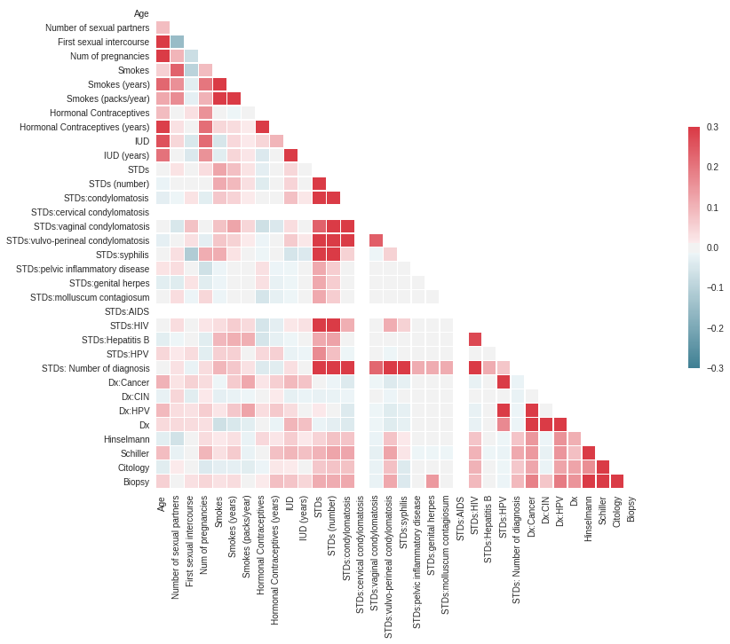
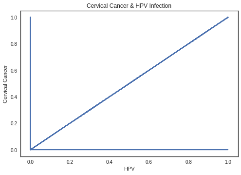

# Cervical Cancer Risk Factor Analysis #

Cervical Cancer Risk Factors for Biopsy: This Dataset is Obtained from UCI Repository and kindly acknowledged!

This file contains a list of Risk Factors for cervical cancer that collected before Biopsy Examination!

About 11,000 new cases of invasive cervical cancer are diagnosed each year in the U.S. However, the number of new cervical cancer cases has been declining steadily over the past decades. Although it is the most preventable type of cancer, each year cervical cancer kills about 4,000 women in the U.S. and about 300,000 women worldwide. In the United States, cervical cancer mortality rates plunged by 74% from 1955 - 1992 thanks to increased screening and early detection with the Pap test.

**Age**
Fifty percent of cervical cancer diagnoses occur in women ages 35 - 54, and about 20% occur in women over 65 years of age. The median age of diagnosis is 48 years. About 15% of women develop cervical cancer between the ages of 20 - 30. Cervical cancer is extremely rare in women younger than age 20. However, many young women become infected with multiple types of human papilloma virus, which then can increase their risk of getting cervical cancer in the future. Young women with early abnormal changes who do not have regular examinations are at high risk for localized cancer by the time they are age 40, and for invasive cancer by age 50. 

**SOCIOECONOMIC AND ETHNIC FACTORS**
Although the rate of cervical cancer has declined among both Caucasian and African-American women over the past decades, it remains much more prevalent in African-Americans -- whose death rates are twice as high as Caucasian women. Hispanic American women have more than twice the risk of invasive cervical cancer as Caucasian women, also due to a lower rate of screening. These differences, however, are almost certainly due to social and economic differences. Numerous studies report that high poverty levels are linked with low screening rates. In addition, lack of health insurance, limited transportation, and language difficulties hinder a poor woman’s access to screening services. 

**HIGH SEXUAL ACTIVITY**
Human papilloma virus (HPV) is the main risk factor for cervical cancer. In adults, the most important risk factor for HPV is sexual activity with an infected person. Women most at risk for cervical cancer are those with a history of multiple sexual partners, sexual intercourse at age 17 years or younger, or both. A woman who has never been sexually active has a very low risk for developing cervical cancer. Sexual activity with multiple partners increases the likelihood of many other sexually transmitted infections (chlamydia, gonorrhea, syphilis).Studies have found an association between chlamydia and cervical cancer risk, including the possibility that chlamydia may prolong HPV infection.

**FAMILY HISTORY**
Women have a higher risk of cervical cancer if they have a first-degree relative (mother, sister) who has had cervical cancer. 

**USE OF ORAL CONTRACEPTIVES**
Studies have reported a strong association between cervical cancer and long-term use of oral contraception (OC). Women who take birth control pills for more than 5 - 10 years appear to have a much higher risk HPV infection (up to four times higher) than those who do not use OCs. (Women taking OCs for fewer than 5 years do not have a significantly higher risk.) The reasons for this risk from OC use are not entirely clear. Women who use OCs may be less likely to use a diaphragm, condoms, or other methods that offer some protection against sexual transmitted diseases, including HPV. Some research also suggests that the hormones in OCs might help the virus enter the genetic material of cervical cells. 

**HAVING MANY CHILDREN**
Studies indicate that having many children increases the risk for developing cervical cancer, particularly in women infected with HPV. SMOKING Smoking is associated with a higher risk for precancerous changes (dysplasia) in the cervix and for progression to invasive cervical cancer, especially for women infected with HPV.

**IMMUNOSUPPRESSION**
Women with weak immune systems, (such as those with HIV / AIDS), are more susceptible to acquiring HPV. Immunocompromised patients are also at higher risk for having cervical precancer develop rapidly into invasive cancer. DIETHYLSTILBESTROL (DES) From 1938 - 1971, diethylstilbestrol (DES), an estrogen-related drug, was widely prescribed to pregnant women to help prevent miscarriages. The daughters of these women face a higher risk for cervical cancer. DES is no longer prsecribed.

Firstly, Let us import the necessary libraries to explore and analyze the data set...


```python
import pandas as pd
import numpy as np
import random
import matplotlib.pyplot as plt
%matplotlib inline
import seaborn as sns

```

Now, let us load the dataset....


```python
df = pd.read_csv("https://archive.ics.uci.edu/ml/machine-learning-databases/00383/risk_factors_cervical_cancer.csv")
```

Next, we will check how the data frame look like by displaying first 5 rows...

## Exploring Data


```python
df.head()
```


<div>
<table border="1" class="dataframe">
  <thead>
    <tr style="text-align: right;">
      <th></th>
      <th>Age</th>
      <th>Number of sexual partners</th>
      <th>First sexual intercourse</th>
      <th>Num of pregnancies</th>
      <th>Smokes</th>
      <th>Smokes (years)</th>
      <th>Smokes (packs/year)</th>
      <th>Hormonal Contraceptives</th>
      <th>Hormonal Contraceptives (years)</th>
      <th>IUD</th>
      <th>...</th>
      <th>STDs: Time since first diagnosis</th>
      <th>STDs: Time since last diagnosis</th>
      <th>Dx:Cancer</th>
      <th>Dx:CIN</th>
      <th>Dx:HPV</th>
      <th>Dx</th>
      <th>Hinselmann</th>
      <th>Schiller</th>
      <th>Citology</th>
      <th>Biopsy</th>
    </tr>
  </thead>
  <tbody>
    <tr>
      <th>0</th>
      <td>18</td>
      <td>4.0</td>
      <td>15.0</td>
      <td>1.0</td>
      <td>0.0</td>
      <td>0.0</td>
      <td>0.0</td>
      <td>0.0</td>
      <td>0.0</td>
      <td>0.0</td>
      <td>...</td>
      <td>?</td>
      <td>?</td>
      <td>0</td>
      <td>0</td>
      <td>0</td>
      <td>0</td>
      <td>0</td>
      <td>0</td>
      <td>0</td>
      <td>0</td>
    </tr>
    <tr>
      <th>1</th>
      <td>15</td>
      <td>1.0</td>
      <td>14.0</td>
      <td>1.0</td>
      <td>0.0</td>
      <td>0.0</td>
      <td>0.0</td>
      <td>0.0</td>
      <td>0.0</td>
      <td>0.0</td>
      <td>...</td>
      <td>?</td>
      <td>?</td>
      <td>0</td>
      <td>0</td>
      <td>0</td>
      <td>0</td>
      <td>0</td>
      <td>0</td>
      <td>0</td>
      <td>0</td>
    </tr>
    <tr>
      <th>2</th>
      <td>34</td>
      <td>1.0</td>
      <td>?</td>
      <td>1.0</td>
      <td>0.0</td>
      <td>0.0</td>
      <td>0.0</td>
      <td>0.0</td>
      <td>0.0</td>
      <td>0.0</td>
      <td>...</td>
      <td>?</td>
      <td>?</td>
      <td>0</td>
      <td>0</td>
      <td>0</td>
      <td>0</td>
      <td>0</td>
      <td>0</td>
      <td>0</td>
      <td>0</td>
    </tr>
    <tr>
      <th>3</th>
      <td>52</td>
      <td>5.0</td>
      <td>16.0</td>
      <td>4.0</td>
      <td>1.0</td>
      <td>37.0</td>
      <td>37.0</td>
      <td>1.0</td>
      <td>3.0</td>
      <td>0.0</td>
      <td>...</td>
      <td>?</td>
      <td>?</td>
      <td>1</td>
      <td>0</td>
      <td>1</td>
      <td>0</td>
      <td>0</td>
      <td>0</td>
      <td>0</td>
      <td>0</td>
    </tr>
    <tr>
      <th>4</th>
      <td>46</td>
      <td>3.0</td>
      <td>21.0</td>
      <td>4.0</td>
      <td>0.0</td>
      <td>0.0</td>
      <td>0.0</td>
      <td>1.0</td>
      <td>15.0</td>
      <td>0.0</td>
      <td>...</td>
      <td>?</td>
      <td>?</td>
      <td>0</td>
      <td>0</td>
      <td>0</td>
      <td>0</td>
      <td>0</td>
      <td>0</td>
      <td>0</td>
      <td>0</td>
    </tr>
  </tbody>
</table>
<p>5 rows × 36 columns</p>
</div>


Since we could not see the complete column, we will check all the columns in the data frame...


```python
df.columns.values
```


    array(['Age', 'Number of sexual partners', 'First sexual intercourse',
           'Num of pregnancies', 'Smokes', 'Smokes (years)',
           'Smokes (packs/year)', 'Hormonal Contraceptives',
           'Hormonal Contraceptives (years)', 'IUD', 'IUD (years)', 'STDs',
           'STDs (number)', 'STDs:condylomatosis',
           'STDs:cervical condylomatosis', 'STDs:vaginal condylomatosis',
           'STDs:vulvo-perineal condylomatosis', 'STDs:syphilis',
           'STDs:pelvic inflammatory disease', 'STDs:genital herpes',
           'STDs:molluscum contagiosum', 'STDs:AIDS', 'STDs:HIV',
           'STDs:Hepatitis B', 'STDs:HPV', 'STDs: Number of diagnosis',
           'STDs: Time since first diagnosis',
           'STDs: Time since last diagnosis', 'Dx:Cancer', 'Dx:CIN', 'Dx:HPV',
           'Dx', 'Hinselmann', 'Schiller', 'Citology', 'Biopsy'], dtype=object)


As we see, there are many columns that are important for our analysis....
So let us see the first 10 rows for all columns by using df.head(10).transpose() command...


```python
df.head(10).transpose()
```


<div>
<table border="1" class="dataframe">
  <thead>
    <tr style="text-align: right;">
      <th></th>
      <th>0</th>
      <th>1</th>
      <th>2</th>
      <th>3</th>
      <th>4</th>
      <th>5</th>
      <th>6</th>
      <th>7</th>
      <th>8</th>
      <th>9</th>
    </tr>
  </thead>
  <tbody>
    <tr>
      <th>Age</th>
      <td>18</td>
      <td>15</td>
      <td>34</td>
      <td>52</td>
      <td>46</td>
      <td>42</td>
      <td>51</td>
      <td>26</td>
      <td>45</td>
      <td>44</td>
    </tr>
    <tr>
      <th>Number of sexual partners</th>
      <td>4.0</td>
      <td>1.0</td>
      <td>1.0</td>
      <td>5.0</td>
      <td>3.0</td>
      <td>3.0</td>
      <td>3.0</td>
      <td>1.0</td>
      <td>1.0</td>
      <td>3.0</td>
    </tr>
    <tr>
      <th>First sexual intercourse</th>
      <td>15.0</td>
      <td>14.0</td>
      <td>?</td>
      <td>16.0</td>
      <td>21.0</td>
      <td>23.0</td>
      <td>17.0</td>
      <td>26.0</td>
      <td>20.0</td>
      <td>15.0</td>
    </tr>
    <tr>
      <th>Num of pregnancies</th>
      <td>1.0</td>
      <td>1.0</td>
      <td>1.0</td>
      <td>4.0</td>
      <td>4.0</td>
      <td>2.0</td>
      <td>6.0</td>
      <td>3.0</td>
      <td>5.0</td>
      <td>?</td>
    </tr>
    <tr>
      <th>Smokes</th>
      <td>0.0</td>
      <td>0.0</td>
      <td>0.0</td>
      <td>1.0</td>
      <td>0.0</td>
      <td>0.0</td>
      <td>1.0</td>
      <td>0.0</td>
      <td>0.0</td>
      <td>1.0</td>
    </tr>
    <tr>
      <th>Smokes (years)</th>
      <td>0.0</td>
      <td>0.0</td>
      <td>0.0</td>
      <td>37.0</td>
      <td>0.0</td>
      <td>0.0</td>
      <td>34.0</td>
      <td>0.0</td>
      <td>0.0</td>
      <td>1.266972909</td>
    </tr>
    <tr>
      <th>Smokes (packs/year)</th>
      <td>0.0</td>
      <td>0.0</td>
      <td>0.0</td>
      <td>37.0</td>
      <td>0.0</td>
      <td>0.0</td>
      <td>3.4</td>
      <td>0.0</td>
      <td>0.0</td>
      <td>2.8</td>
    </tr>
    <tr>
      <th>Hormonal Contraceptives</th>
      <td>0.0</td>
      <td>0.0</td>
      <td>0.0</td>
      <td>1.0</td>
      <td>1.0</td>
      <td>0.0</td>
      <td>0.0</td>
      <td>1.0</td>
      <td>0.0</td>
      <td>0.0</td>
    </tr>
    <tr>
      <th>Hormonal Contraceptives (years)</th>
      <td>0.0</td>
      <td>0.0</td>
      <td>0.0</td>
      <td>3.0</td>
      <td>15.0</td>
      <td>0.0</td>
      <td>0.0</td>
      <td>2.0</td>
      <td>0.0</td>
      <td>0.0</td>
    </tr>
    <tr>
      <th>IUD</th>
      <td>0.0</td>
      <td>0.0</td>
      <td>0.0</td>
      <td>0.0</td>
      <td>0.0</td>
      <td>0.0</td>
      <td>1.0</td>
      <td>1.0</td>
      <td>0.0</td>
      <td>?</td>
    </tr>
    <tr>
      <th>IUD (years)</th>
      <td>0.0</td>
      <td>0.0</td>
      <td>0.0</td>
      <td>0.0</td>
      <td>0.0</td>
      <td>0.0</td>
      <td>7.0</td>
      <td>7.0</td>
      <td>0.0</td>
      <td>?</td>
    </tr>
    <tr>
      <th>STDs</th>
      <td>0.0</td>
      <td>0.0</td>
      <td>0.0</td>
      <td>0.0</td>
      <td>0.0</td>
      <td>0.0</td>
      <td>0.0</td>
      <td>0.0</td>
      <td>0.0</td>
      <td>0.0</td>
    </tr>
    <tr>
      <th>STDs (number)</th>
      <td>0.0</td>
      <td>0.0</td>
      <td>0.0</td>
      <td>0.0</td>
      <td>0.0</td>
      <td>0.0</td>
      <td>0.0</td>
      <td>0.0</td>
      <td>0.0</td>
      <td>0.0</td>
    </tr>
    <tr>
      <th>STDs:condylomatosis</th>
      <td>0.0</td>
      <td>0.0</td>
      <td>0.0</td>
      <td>0.0</td>
      <td>0.0</td>
      <td>0.0</td>
      <td>0.0</td>
      <td>0.0</td>
      <td>0.0</td>
      <td>0.0</td>
    </tr>
    <tr>
      <th>STDs:cervical condylomatosis</th>
      <td>0.0</td>
      <td>0.0</td>
      <td>0.0</td>
      <td>0.0</td>
      <td>0.0</td>
      <td>0.0</td>
      <td>0.0</td>
      <td>0.0</td>
      <td>0.0</td>
      <td>0.0</td>
    </tr>
    <tr>
      <th>STDs:vaginal condylomatosis</th>
      <td>0.0</td>
      <td>0.0</td>
      <td>0.0</td>
      <td>0.0</td>
      <td>0.0</td>
      <td>0.0</td>
      <td>0.0</td>
      <td>0.0</td>
      <td>0.0</td>
      <td>0.0</td>
    </tr>
    <tr>
      <th>STDs:vulvo-perineal condylomatosis</th>
      <td>0.0</td>
      <td>0.0</td>
      <td>0.0</td>
      <td>0.0</td>
      <td>0.0</td>
      <td>0.0</td>
      <td>0.0</td>
      <td>0.0</td>
      <td>0.0</td>
      <td>0.0</td>
    </tr>
    <tr>
      <th>STDs:syphilis</th>
      <td>0.0</td>
      <td>0.0</td>
      <td>0.0</td>
      <td>0.0</td>
      <td>0.0</td>
      <td>0.0</td>
      <td>0.0</td>
      <td>0.0</td>
      <td>0.0</td>
      <td>0.0</td>
    </tr>
    <tr>
      <th>STDs:pelvic inflammatory disease</th>
      <td>0.0</td>
      <td>0.0</td>
      <td>0.0</td>
      <td>0.0</td>
      <td>0.0</td>
      <td>0.0</td>
      <td>0.0</td>
      <td>0.0</td>
      <td>0.0</td>
      <td>0.0</td>
    </tr>
    <tr>
      <th>STDs:genital herpes</th>
      <td>0.0</td>
      <td>0.0</td>
      <td>0.0</td>
      <td>0.0</td>
      <td>0.0</td>
      <td>0.0</td>
      <td>0.0</td>
      <td>0.0</td>
      <td>0.0</td>
      <td>0.0</td>
    </tr>
    <tr>
      <th>STDs:molluscum contagiosum</th>
      <td>0.0</td>
      <td>0.0</td>
      <td>0.0</td>
      <td>0.0</td>
      <td>0.0</td>
      <td>0.0</td>
      <td>0.0</td>
      <td>0.0</td>
      <td>0.0</td>
      <td>0.0</td>
    </tr>
    <tr>
      <th>STDs:AIDS</th>
      <td>0.0</td>
      <td>0.0</td>
      <td>0.0</td>
      <td>0.0</td>
      <td>0.0</td>
      <td>0.0</td>
      <td>0.0</td>
      <td>0.0</td>
      <td>0.0</td>
      <td>0.0</td>
    </tr>
    <tr>
      <th>STDs:HIV</th>
      <td>0.0</td>
      <td>0.0</td>
      <td>0.0</td>
      <td>0.0</td>
      <td>0.0</td>
      <td>0.0</td>
      <td>0.0</td>
      <td>0.0</td>
      <td>0.0</td>
      <td>0.0</td>
    </tr>
    <tr>
      <th>STDs:Hepatitis B</th>
      <td>0.0</td>
      <td>0.0</td>
      <td>0.0</td>
      <td>0.0</td>
      <td>0.0</td>
      <td>0.0</td>
      <td>0.0</td>
      <td>0.0</td>
      <td>0.0</td>
      <td>0.0</td>
    </tr>
    <tr>
      <th>STDs:HPV</th>
      <td>0.0</td>
      <td>0.0</td>
      <td>0.0</td>
      <td>0.0</td>
      <td>0.0</td>
      <td>0.0</td>
      <td>0.0</td>
      <td>0.0</td>
      <td>0.0</td>
      <td>0.0</td>
    </tr>
    <tr>
      <th>STDs: Number of diagnosis</th>
      <td>0</td>
      <td>0</td>
      <td>0</td>
      <td>0</td>
      <td>0</td>
      <td>0</td>
      <td>0</td>
      <td>0</td>
      <td>0</td>
      <td>0</td>
    </tr>
    <tr>
      <th>STDs: Time since first diagnosis</th>
      <td>?</td>
      <td>?</td>
      <td>?</td>
      <td>?</td>
      <td>?</td>
      <td>?</td>
      <td>?</td>
      <td>?</td>
      <td>?</td>
      <td>?</td>
    </tr>
    <tr>
      <th>STDs: Time since last diagnosis</th>
      <td>?</td>
      <td>?</td>
      <td>?</td>
      <td>?</td>
      <td>?</td>
      <td>?</td>
      <td>?</td>
      <td>?</td>
      <td>?</td>
      <td>?</td>
    </tr>
    <tr>
      <th>Dx:Cancer</th>
      <td>0</td>
      <td>0</td>
      <td>0</td>
      <td>1</td>
      <td>0</td>
      <td>0</td>
      <td>0</td>
      <td>0</td>
      <td>1</td>
      <td>0</td>
    </tr>
    <tr>
      <th>Dx:CIN</th>
      <td>0</td>
      <td>0</td>
      <td>0</td>
      <td>0</td>
      <td>0</td>
      <td>0</td>
      <td>0</td>
      <td>0</td>
      <td>0</td>
      <td>0</td>
    </tr>
    <tr>
      <th>Dx:HPV</th>
      <td>0</td>
      <td>0</td>
      <td>0</td>
      <td>1</td>
      <td>0</td>
      <td>0</td>
      <td>0</td>
      <td>0</td>
      <td>1</td>
      <td>0</td>
    </tr>
    <tr>
      <th>Dx</th>
      <td>0</td>
      <td>0</td>
      <td>0</td>
      <td>0</td>
      <td>0</td>
      <td>0</td>
      <td>0</td>
      <td>0</td>
      <td>1</td>
      <td>0</td>
    </tr>
    <tr>
      <th>Hinselmann</th>
      <td>0</td>
      <td>0</td>
      <td>0</td>
      <td>0</td>
      <td>0</td>
      <td>0</td>
      <td>1</td>
      <td>0</td>
      <td>0</td>
      <td>0</td>
    </tr>
    <tr>
      <th>Schiller</th>
      <td>0</td>
      <td>0</td>
      <td>0</td>
      <td>0</td>
      <td>0</td>
      <td>0</td>
      <td>1</td>
      <td>0</td>
      <td>0</td>
      <td>0</td>
    </tr>
    <tr>
      <th>Citology</th>
      <td>0</td>
      <td>0</td>
      <td>0</td>
      <td>0</td>
      <td>0</td>
      <td>0</td>
      <td>0</td>
      <td>0</td>
      <td>0</td>
      <td>0</td>
    </tr>
    <tr>
      <th>Biopsy</th>
      <td>0</td>
      <td>0</td>
      <td>0</td>
      <td>0</td>
      <td>0</td>
      <td>0</td>
      <td>1</td>
      <td>0</td>
      <td>0</td>
      <td>0</td>
    </tr>
  </tbody>
</table>
</div>


```python
df.shape
```


    (858, 36)


Next, let us explore the descriptive statistics on our data set to get more insight in to the data.


```python
df.describe().transpose()
```


<div>
<table border="1" class="dataframe">
  <thead>
    <tr style="text-align: right;">
      <th></th>
      <th>count</th>
      <th>mean</th>
      <th>std</th>
      <th>min</th>
      <th>25%</th>
      <th>50%</th>
      <th>75%</th>
      <th>max</th>
    </tr>
  </thead>
  <tbody>
    <tr>
      <th>Age</th>
      <td>858.0</td>
      <td>26.820513</td>
      <td>8.497948</td>
      <td>13.0</td>
      <td>20.0</td>
      <td>25.0</td>
      <td>32.0</td>
      <td>84.0</td>
    </tr>
    <tr>
      <th>STDs: Number of diagnosis</th>
      <td>858.0</td>
      <td>0.087413</td>
      <td>0.302545</td>
      <td>0.0</td>
      <td>0.0</td>
      <td>0.0</td>
      <td>0.0</td>
      <td>3.0</td>
    </tr>
    <tr>
      <th>Dx:Cancer</th>
      <td>858.0</td>
      <td>0.020979</td>
      <td>0.143398</td>
      <td>0.0</td>
      <td>0.0</td>
      <td>0.0</td>
      <td>0.0</td>
      <td>1.0</td>
    </tr>
    <tr>
      <th>Dx:CIN</th>
      <td>858.0</td>
      <td>0.010490</td>
      <td>0.101939</td>
      <td>0.0</td>
      <td>0.0</td>
      <td>0.0</td>
      <td>0.0</td>
      <td>1.0</td>
    </tr>
    <tr>
      <th>Dx:HPV</th>
      <td>858.0</td>
      <td>0.020979</td>
      <td>0.143398</td>
      <td>0.0</td>
      <td>0.0</td>
      <td>0.0</td>
      <td>0.0</td>
      <td>1.0</td>
    </tr>
    <tr>
      <th>Dx</th>
      <td>858.0</td>
      <td>0.027972</td>
      <td>0.164989</td>
      <td>0.0</td>
      <td>0.0</td>
      <td>0.0</td>
      <td>0.0</td>
      <td>1.0</td>
    </tr>
    <tr>
      <th>Hinselmann</th>
      <td>858.0</td>
      <td>0.040793</td>
      <td>0.197925</td>
      <td>0.0</td>
      <td>0.0</td>
      <td>0.0</td>
      <td>0.0</td>
      <td>1.0</td>
    </tr>
    <tr>
      <th>Schiller</th>
      <td>858.0</td>
      <td>0.086247</td>
      <td>0.280892</td>
      <td>0.0</td>
      <td>0.0</td>
      <td>0.0</td>
      <td>0.0</td>
      <td>1.0</td>
    </tr>
    <tr>
      <th>Citology</th>
      <td>858.0</td>
      <td>0.051282</td>
      <td>0.220701</td>
      <td>0.0</td>
      <td>0.0</td>
      <td>0.0</td>
      <td>0.0</td>
      <td>1.0</td>
    </tr>
    <tr>
      <th>Biopsy</th>
      <td>858.0</td>
      <td>0.064103</td>
      <td>0.245078</td>
      <td>0.0</td>
      <td>0.0</td>
      <td>0.0</td>
      <td>0.0</td>
      <td>1.0</td>
    </tr>
  </tbody>
</table>
</div>


We could see details of only 10 columns. This means that other columns are non numeric.... So we will use dataFrame.describe(include="all") method to get the details of all columns.


```python
df.describe(include="all").transpose()
```


<div>
<table border="1" class="dataframe">
  <thead>
    <tr style="text-align: right;">
      <th></th>
      <th>count</th>
      <th>unique</th>
      <th>top</th>
      <th>freq</th>
      <th>mean</th>
      <th>std</th>
      <th>min</th>
      <th>25%</th>
      <th>50%</th>
      <th>75%</th>
      <th>max</th>
    </tr>
  </thead>
  <tbody>
    <tr>
      <th>Age</th>
      <td>858</td>
      <td>NaN</td>
      <td>NaN</td>
      <td>NaN</td>
      <td>26.8205</td>
      <td>8.49795</td>
      <td>13</td>
      <td>20</td>
      <td>25</td>
      <td>32</td>
      <td>84</td>
    </tr>
    <tr>
      <th>Number of sexual partners</th>
      <td>858</td>
      <td>13</td>
      <td>2.0</td>
      <td>272</td>
      <td>NaN</td>
      <td>NaN</td>
      <td>NaN</td>
      <td>NaN</td>
      <td>NaN</td>
      <td>NaN</td>
      <td>NaN</td>
    </tr>
    <tr>
      <th>First sexual intercourse</th>
      <td>858</td>
      <td>22</td>
      <td>15.0</td>
      <td>163</td>
      <td>NaN</td>
      <td>NaN</td>
      <td>NaN</td>
      <td>NaN</td>
      <td>NaN</td>
      <td>NaN</td>
      <td>NaN</td>
    </tr>
    <tr>
      <th>Num of pregnancies</th>
      <td>858</td>
      <td>12</td>
      <td>1.0</td>
      <td>270</td>
      <td>NaN</td>
      <td>NaN</td>
      <td>NaN</td>
      <td>NaN</td>
      <td>NaN</td>
      <td>NaN</td>
      <td>NaN</td>
    </tr>
    <tr>
      <th>Smokes</th>
      <td>858</td>
      <td>3</td>
      <td>0.0</td>
      <td>722</td>
      <td>NaN</td>
      <td>NaN</td>
      <td>NaN</td>
      <td>NaN</td>
      <td>NaN</td>
      <td>NaN</td>
      <td>NaN</td>
    </tr>
    <tr>
      <th>Smokes (years)</th>
      <td>858</td>
      <td>31</td>
      <td>0.0</td>
      <td>722</td>
      <td>NaN</td>
      <td>NaN</td>
      <td>NaN</td>
      <td>NaN</td>
      <td>NaN</td>
      <td>NaN</td>
      <td>NaN</td>
    </tr>
    <tr>
      <th>Smokes (packs/year)</th>
      <td>858</td>
      <td>63</td>
      <td>0.0</td>
      <td>722</td>
      <td>NaN</td>
      <td>NaN</td>
      <td>NaN</td>
      <td>NaN</td>
      <td>NaN</td>
      <td>NaN</td>
      <td>NaN</td>
    </tr>
    <tr>
      <th>Hormonal Contraceptives</th>
      <td>858</td>
      <td>3</td>
      <td>1.0</td>
      <td>481</td>
      <td>NaN</td>
      <td>NaN</td>
      <td>NaN</td>
      <td>NaN</td>
      <td>NaN</td>
      <td>NaN</td>
      <td>NaN</td>
    </tr>
    <tr>
      <th>Hormonal Contraceptives (years)</th>
      <td>858</td>
      <td>41</td>
      <td>0.0</td>
      <td>269</td>
      <td>NaN</td>
      <td>NaN</td>
      <td>NaN</td>
      <td>NaN</td>
      <td>NaN</td>
      <td>NaN</td>
      <td>NaN</td>
    </tr>
    <tr>
      <th>IUD</th>
      <td>858</td>
      <td>3</td>
      <td>0.0</td>
      <td>658</td>
      <td>NaN</td>
      <td>NaN</td>
      <td>NaN</td>
      <td>NaN</td>
      <td>NaN</td>
      <td>NaN</td>
      <td>NaN</td>
    </tr>
    <tr>
      <th>IUD (years)</th>
      <td>858</td>
      <td>27</td>
      <td>0.0</td>
      <td>658</td>
      <td>NaN</td>
      <td>NaN</td>
      <td>NaN</td>
      <td>NaN</td>
      <td>NaN</td>
      <td>NaN</td>
      <td>NaN</td>
    </tr>
    <tr>
      <th>STDs</th>
      <td>858</td>
      <td>3</td>
      <td>0.0</td>
      <td>674</td>
      <td>NaN</td>
      <td>NaN</td>
      <td>NaN</td>
      <td>NaN</td>
      <td>NaN</td>
      <td>NaN</td>
      <td>NaN</td>
    </tr>
    <tr>
      <th>STDs (number)</th>
      <td>858</td>
      <td>6</td>
      <td>0.0</td>
      <td>674</td>
      <td>NaN</td>
      <td>NaN</td>
      <td>NaN</td>
      <td>NaN</td>
      <td>NaN</td>
      <td>NaN</td>
      <td>NaN</td>
    </tr>
    <tr>
      <th>STDs:condylomatosis</th>
      <td>858</td>
      <td>3</td>
      <td>0.0</td>
      <td>709</td>
      <td>NaN</td>
      <td>NaN</td>
      <td>NaN</td>
      <td>NaN</td>
      <td>NaN</td>
      <td>NaN</td>
      <td>NaN</td>
    </tr>
    <tr>
      <th>STDs:cervical condylomatosis</th>
      <td>858</td>
      <td>2</td>
      <td>0.0</td>
      <td>753</td>
      <td>NaN</td>
      <td>NaN</td>
      <td>NaN</td>
      <td>NaN</td>
      <td>NaN</td>
      <td>NaN</td>
      <td>NaN</td>
    </tr>
    <tr>
      <th>STDs:vaginal condylomatosis</th>
      <td>858</td>
      <td>3</td>
      <td>0.0</td>
      <td>749</td>
      <td>NaN</td>
      <td>NaN</td>
      <td>NaN</td>
      <td>NaN</td>
      <td>NaN</td>
      <td>NaN</td>
      <td>NaN</td>
    </tr>
    <tr>
      <th>STDs:vulvo-perineal condylomatosis</th>
      <td>858</td>
      <td>3</td>
      <td>0.0</td>
      <td>710</td>
      <td>NaN</td>
      <td>NaN</td>
      <td>NaN</td>
      <td>NaN</td>
      <td>NaN</td>
      <td>NaN</td>
      <td>NaN</td>
    </tr>
    <tr>
      <th>STDs:syphilis</th>
      <td>858</td>
      <td>3</td>
      <td>0.0</td>
      <td>735</td>
      <td>NaN</td>
      <td>NaN</td>
      <td>NaN</td>
      <td>NaN</td>
      <td>NaN</td>
      <td>NaN</td>
      <td>NaN</td>
    </tr>
    <tr>
      <th>STDs:pelvic inflammatory disease</th>
      <td>858</td>
      <td>3</td>
      <td>0.0</td>
      <td>752</td>
      <td>NaN</td>
      <td>NaN</td>
      <td>NaN</td>
      <td>NaN</td>
      <td>NaN</td>
      <td>NaN</td>
      <td>NaN</td>
    </tr>
    <tr>
      <th>STDs:genital herpes</th>
      <td>858</td>
      <td>3</td>
      <td>0.0</td>
      <td>752</td>
      <td>NaN</td>
      <td>NaN</td>
      <td>NaN</td>
      <td>NaN</td>
      <td>NaN</td>
      <td>NaN</td>
      <td>NaN</td>
    </tr>
    <tr>
      <th>STDs:molluscum contagiosum</th>
      <td>858</td>
      <td>3</td>
      <td>0.0</td>
      <td>752</td>
      <td>NaN</td>
      <td>NaN</td>
      <td>NaN</td>
      <td>NaN</td>
      <td>NaN</td>
      <td>NaN</td>
      <td>NaN</td>
    </tr>
    <tr>
      <th>STDs:AIDS</th>
      <td>858</td>
      <td>2</td>
      <td>0.0</td>
      <td>753</td>
      <td>NaN</td>
      <td>NaN</td>
      <td>NaN</td>
      <td>NaN</td>
      <td>NaN</td>
      <td>NaN</td>
      <td>NaN</td>
    </tr>
    <tr>
      <th>STDs:HIV</th>
      <td>858</td>
      <td>3</td>
      <td>0.0</td>
      <td>735</td>
      <td>NaN</td>
      <td>NaN</td>
      <td>NaN</td>
      <td>NaN</td>
      <td>NaN</td>
      <td>NaN</td>
      <td>NaN</td>
    </tr>
    <tr>
      <th>STDs:Hepatitis B</th>
      <td>858</td>
      <td>3</td>
      <td>0.0</td>
      <td>752</td>
      <td>NaN</td>
      <td>NaN</td>
      <td>NaN</td>
      <td>NaN</td>
      <td>NaN</td>
      <td>NaN</td>
      <td>NaN</td>
    </tr>
    <tr>
      <th>STDs:HPV</th>
      <td>858</td>
      <td>3</td>
      <td>0.0</td>
      <td>751</td>
      <td>NaN</td>
      <td>NaN</td>
      <td>NaN</td>
      <td>NaN</td>
      <td>NaN</td>
      <td>NaN</td>
      <td>NaN</td>
    </tr>
    <tr>
      <th>STDs: Number of diagnosis</th>
      <td>858</td>
      <td>NaN</td>
      <td>NaN</td>
      <td>NaN</td>
      <td>0.0874126</td>
      <td>0.302545</td>
      <td>0</td>
      <td>0</td>
      <td>0</td>
      <td>0</td>
      <td>3</td>
    </tr>
    <tr>
      <th>STDs: Time since first diagnosis</th>
      <td>858</td>
      <td>19</td>
      <td>?</td>
      <td>787</td>
      <td>NaN</td>
      <td>NaN</td>
      <td>NaN</td>
      <td>NaN</td>
      <td>NaN</td>
      <td>NaN</td>
      <td>NaN</td>
    </tr>
    <tr>
      <th>STDs: Time since last diagnosis</th>
      <td>858</td>
      <td>19</td>
      <td>?</td>
      <td>787</td>
      <td>NaN</td>
      <td>NaN</td>
      <td>NaN</td>
      <td>NaN</td>
      <td>NaN</td>
      <td>NaN</td>
      <td>NaN</td>
    </tr>
    <tr>
      <th>Dx:Cancer</th>
      <td>858</td>
      <td>NaN</td>
      <td>NaN</td>
      <td>NaN</td>
      <td>0.020979</td>
      <td>0.143398</td>
      <td>0</td>
      <td>0</td>
      <td>0</td>
      <td>0</td>
      <td>1</td>
    </tr>
    <tr>
      <th>Dx:CIN</th>
      <td>858</td>
      <td>NaN</td>
      <td>NaN</td>
      <td>NaN</td>
      <td>0.0104895</td>
      <td>0.101939</td>
      <td>0</td>
      <td>0</td>
      <td>0</td>
      <td>0</td>
      <td>1</td>
    </tr>
    <tr>
      <th>Dx:HPV</th>
      <td>858</td>
      <td>NaN</td>
      <td>NaN</td>
      <td>NaN</td>
      <td>0.020979</td>
      <td>0.143398</td>
      <td>0</td>
      <td>0</td>
      <td>0</td>
      <td>0</td>
      <td>1</td>
    </tr>
    <tr>
      <th>Dx</th>
      <td>858</td>
      <td>NaN</td>
      <td>NaN</td>
      <td>NaN</td>
      <td>0.027972</td>
      <td>0.164989</td>
      <td>0</td>
      <td>0</td>
      <td>0</td>
      <td>0</td>
      <td>1</td>
    </tr>
    <tr>
      <th>Hinselmann</th>
      <td>858</td>
      <td>NaN</td>
      <td>NaN</td>
      <td>NaN</td>
      <td>0.0407925</td>
      <td>0.197925</td>
      <td>0</td>
      <td>0</td>
      <td>0</td>
      <td>0</td>
      <td>1</td>
    </tr>
    <tr>
      <th>Schiller</th>
      <td>858</td>
      <td>NaN</td>
      <td>NaN</td>
      <td>NaN</td>
      <td>0.0862471</td>
      <td>0.280892</td>
      <td>0</td>
      <td>0</td>
      <td>0</td>
      <td>0</td>
      <td>1</td>
    </tr>
    <tr>
      <th>Citology</th>
      <td>858</td>
      <td>NaN</td>
      <td>NaN</td>
      <td>NaN</td>
      <td>0.0512821</td>
      <td>0.220701</td>
      <td>0</td>
      <td>0</td>
      <td>0</td>
      <td>0</td>
      <td>1</td>
    </tr>
    <tr>
      <th>Biopsy</th>
      <td>858</td>
      <td>NaN</td>
      <td>NaN</td>
      <td>NaN</td>
      <td>0.0641026</td>
      <td>0.245078</td>
      <td>0</td>
      <td>0</td>
      <td>0</td>
      <td>0</td>
      <td>1</td>
    </tr>
  </tbody>
</table>
</div>


```python
df.info()
```

    <class 'pandas.core.frame.DataFrame'>
    RangeIndex: 858 entries, 0 to 857
    Data columns (total 36 columns):
    Age                                   858 non-null int64
    Number of sexual partners             858 non-null object
    First sexual intercourse              858 non-null object
    Num of pregnancies                    858 non-null object
    Smokes                                858 non-null object
    Smokes (years)                        858 non-null object
    Smokes (packs/year)                   858 non-null object
    Hormonal Contraceptives               858 non-null object
    Hormonal Contraceptives (years)       858 non-null object
    IUD                                   858 non-null object
    IUD (years)                           858 non-null object
    STDs                                  858 non-null object
    STDs (number)                         858 non-null object
    STDs:condylomatosis                   858 non-null object
    STDs:cervical condylomatosis          858 non-null object
    STDs:vaginal condylomatosis           858 non-null object
    STDs:vulvo-perineal condylomatosis    858 non-null object
    STDs:syphilis                         858 non-null object
    STDs:pelvic inflammatory disease      858 non-null object
    STDs:genital herpes                   858 non-null object
    STDs:molluscum contagiosum            858 non-null object
    STDs:AIDS                             858 non-null object
    STDs:HIV                              858 non-null object
    STDs:Hepatitis B                      858 non-null object
    STDs:HPV                              858 non-null object
    STDs: Number of diagnosis             858 non-null int64
    STDs: Time since first diagnosis      858 non-null object
    STDs: Time since last diagnosis       858 non-null object
    Dx:Cancer                             858 non-null int64
    Dx:CIN                                858 non-null int64
    Dx:HPV                                858 non-null int64
    Dx                                    858 non-null int64
    Hinselmann                            858 non-null int64
    Schiller                              858 non-null int64
    Citology                              858 non-null int64
    Biopsy                                858 non-null int64
    dtypes: int64(10), object(26)
    memory usage: 241.4+ KB


## Data Cleaning: Handling Missing Data

As we can see that  there are 26 object type data types in our data set....We need to convert all the objective data type columns to numeric data type for our analysis. We will do it later.


Now let us examine how many null values are there...


```python
df.isnull().any()
```


    Age                                   False
    Number of sexual partners              True
    First sexual intercourse               True
    Num of pregnancies                     True
    Smokes                                 True
    Smokes (years)                         True
    Smokes (packs/year)                    True
    Hormonal Contraceptives                True
    Hormonal Contraceptives (years)        True
    IUD                                    True
    IUD (years)                            True
    STDs                                   True
    STDs (number)                          True
    STDs:condylomatosis                    True
    STDs:cervical condylomatosis           True
    STDs:vaginal condylomatosis            True
    STDs:vulvo-perineal condylomatosis     True
    STDs:syphilis                          True
    STDs:pelvic inflammatory disease       True
    STDs:genital herpes                    True
    STDs:molluscum contagiosum             True
    STDs:AIDS                              True
    STDs:HIV                               True
    STDs:Hepatitis B                       True
    STDs:HPV                               True
    STDs: Number of diagnosis             False
    STDs: Time since first diagnosis       True
    STDs: Time since last diagnosis        True
    Dx:Cancer                             False
    Dx:CIN                                False
    Dx:HPV                                False
    Dx                                    False
    Hinselmann                            False
    Schiller                              False
    Citology                              False
    Biopsy                                False
    dtype: bool


seems to be that non value columns are filled with "?" character. So we need covert those values to "NaN" character...


```python
df = df.replace('?', np.nan)
```


```python
df.isnull().any()
```


    Age                                   False
    Number of sexual partners              True
    First sexual intercourse               True
    Num of pregnancies                     True
    Smokes                                 True
    Smokes (years)                         True
    Smokes (packs/year)                    True
    Hormonal Contraceptives                True
    Hormonal Contraceptives (years)        True
    IUD                                    True
    IUD (years)                            True
    STDs                                   True
    STDs (number)                          True
    STDs:condylomatosis                    True
    STDs:cervical condylomatosis           True
    STDs:vaginal condylomatosis            True
    STDs:vulvo-perineal condylomatosis     True
    STDs:syphilis                          True
    STDs:pelvic inflammatory disease       True
    STDs:genital herpes                    True
    STDs:molluscum contagiosum             True
    STDs:AIDS                              True
    STDs:HIV                               True
    STDs:Hepatitis B                       True
    STDs:HPV                               True
    STDs: Number of diagnosis             False
    STDs: Time since first diagnosis       True
    STDs: Time since last diagnosis        True
    Dx:Cancer                             False
    Dx:CIN                                False
    Dx:HPV                                False
    Dx                                    False
    Hinselmann                            False
    Schiller                              False
    Citology                              False
    Biopsy                                False
    dtype: bool


```python
df.isnull().sum()
```


    Age                                     0
    Number of sexual partners              26
    First sexual intercourse                7
    Num of pregnancies                     56
    Smokes                                 13
    Smokes (years)                         13
    Smokes (packs/year)                    13
    Hormonal Contraceptives               108
    Hormonal Contraceptives (years)       108
    IUD                                   117
    IUD (years)                           117
    STDs                                  105
    STDs (number)                         105
    STDs:condylomatosis                   105
    STDs:cervical condylomatosis          105
    STDs:vaginal condylomatosis           105
    STDs:vulvo-perineal condylomatosis    105
    STDs:syphilis                         105
    STDs:pelvic inflammatory disease      105
    STDs:genital herpes                   105
    STDs:molluscum contagiosum            105
    STDs:AIDS                             105
    STDs:HIV                              105
    STDs:Hepatitis B                      105
    STDs:HPV                              105
    STDs: Number of diagnosis               0
    STDs: Time since first diagnosis      787
    STDs: Time since last diagnosis       787
    Dx:Cancer                               0
    Dx:CIN                                  0
    Dx:HPV                                  0
    Dx                                      0
    Hinselmann                              0
    Schiller                                0
    Citology                                0
    Biopsy                                  0
    dtype: int64


Now, we can see that there are many NaN values are in objective data type columns....

Also, two columns "STDs: Time since first diagnosis" and "STDs: Time since last diagnosis" are having majority of the values as NaN. So we will drop these two columns. 


```python
df = df.drop(['STDs: Time since first diagnosis', 'STDs: Time since last diagnosis'], axis=1)
```


```python
df.shape
```


    (858, 34)


## Fixing Null Values by Deleting Them

For the easy analysis, we will drop all the rows containing Nan.


```python
df = df.dropna(axis=0)
```


```python
df.shape
```


    (668, 34)


Now only 34 columns are available in our data set.

Now let us convert all columns to numeric data type....


```python
df = df.convert_objects(convert_numeric=True)
```

    /home/shahir/anaconda2/lib/python2.7/site-packages/ipykernel/__main__.py:1: FutureWarning: convert_objects is deprecated.  Use the data-type specific converters pd.to_datetime, pd.to_timedelta and pd.to_numeric.
      if __name__ == '__main__':


```python
df.info()
```

    <class 'pandas.core.frame.DataFrame'>
    Int64Index: 668 entries, 0 to 857
    Data columns (total 34 columns):
    Age                                   668 non-null int64
    Number of sexual partners             668 non-null float64
    First sexual intercourse              668 non-null float64
    Num of pregnancies                    668 non-null float64
    Smokes                                668 non-null float64
    Smokes (years)                        668 non-null float64
    Smokes (packs/year)                   668 non-null float64
    Hormonal Contraceptives               668 non-null float64
    Hormonal Contraceptives (years)       668 non-null float64
    IUD                                   668 non-null float64
    IUD (years)                           668 non-null float64
    STDs                                  668 non-null float64
    STDs (number)                         668 non-null float64
    STDs:condylomatosis                   668 non-null float64
    STDs:cervical condylomatosis          668 non-null float64
    STDs:vaginal condylomatosis           668 non-null float64
    STDs:vulvo-perineal condylomatosis    668 non-null float64
    STDs:syphilis                         668 non-null float64
    STDs:pelvic inflammatory disease      668 non-null float64
    STDs:genital herpes                   668 non-null float64
    STDs:molluscum contagiosum            668 non-null float64
    STDs:AIDS                             668 non-null float64
    STDs:HIV                              668 non-null float64
    STDs:Hepatitis B                      668 non-null float64
    STDs:HPV                              668 non-null float64
    STDs: Number of diagnosis             668 non-null int64
    Dx:Cancer                             668 non-null int64
    Dx:CIN                                668 non-null int64
    Dx:HPV                                668 non-null int64
    Dx                                    668 non-null int64
    Hinselmann                            668 non-null int64
    Schiller                              668 non-null int64
    Citology                              668 non-null int64
    Biopsy                                668 non-null int64
    dtypes: float64(24), int64(10)
    memory usage: 182.7 KB


```python
df.head()
```


<div>
<table border="1" class="dataframe">
  <thead>
    <tr style="text-align: right;">
      <th></th>
      <th>Age</th>
      <th>Number of sexual partners</th>
      <th>First sexual intercourse</th>
      <th>Num of pregnancies</th>
      <th>Smokes</th>
      <th>Smokes (years)</th>
      <th>Smokes (packs/year)</th>
      <th>Hormonal Contraceptives</th>
      <th>Hormonal Contraceptives (years)</th>
      <th>IUD</th>
      <th>...</th>
      <th>STDs:HPV</th>
      <th>STDs: Number of diagnosis</th>
      <th>Dx:Cancer</th>
      <th>Dx:CIN</th>
      <th>Dx:HPV</th>
      <th>Dx</th>
      <th>Hinselmann</th>
      <th>Schiller</th>
      <th>Citology</th>
      <th>Biopsy</th>
    </tr>
  </thead>
  <tbody>
    <tr>
      <th>0</th>
      <td>18</td>
      <td>4.0</td>
      <td>15.0</td>
      <td>1.0</td>
      <td>0.0</td>
      <td>0.0</td>
      <td>0.0</td>
      <td>0.0</td>
      <td>0.0</td>
      <td>0.0</td>
      <td>...</td>
      <td>0.0</td>
      <td>0</td>
      <td>0</td>
      <td>0</td>
      <td>0</td>
      <td>0</td>
      <td>0</td>
      <td>0</td>
      <td>0</td>
      <td>0</td>
    </tr>
    <tr>
      <th>1</th>
      <td>15</td>
      <td>1.0</td>
      <td>14.0</td>
      <td>1.0</td>
      <td>0.0</td>
      <td>0.0</td>
      <td>0.0</td>
      <td>0.0</td>
      <td>0.0</td>
      <td>0.0</td>
      <td>...</td>
      <td>0.0</td>
      <td>0</td>
      <td>0</td>
      <td>0</td>
      <td>0</td>
      <td>0</td>
      <td>0</td>
      <td>0</td>
      <td>0</td>
      <td>0</td>
    </tr>
    <tr>
      <th>3</th>
      <td>52</td>
      <td>5.0</td>
      <td>16.0</td>
      <td>4.0</td>
      <td>1.0</td>
      <td>37.0</td>
      <td>37.0</td>
      <td>1.0</td>
      <td>3.0</td>
      <td>0.0</td>
      <td>...</td>
      <td>0.0</td>
      <td>0</td>
      <td>1</td>
      <td>0</td>
      <td>1</td>
      <td>0</td>
      <td>0</td>
      <td>0</td>
      <td>0</td>
      <td>0</td>
    </tr>
    <tr>
      <th>4</th>
      <td>46</td>
      <td>3.0</td>
      <td>21.0</td>
      <td>4.0</td>
      <td>0.0</td>
      <td>0.0</td>
      <td>0.0</td>
      <td>1.0</td>
      <td>15.0</td>
      <td>0.0</td>
      <td>...</td>
      <td>0.0</td>
      <td>0</td>
      <td>0</td>
      <td>0</td>
      <td>0</td>
      <td>0</td>
      <td>0</td>
      <td>0</td>
      <td>0</td>
      <td>0</td>
    </tr>
    <tr>
      <th>5</th>
      <td>42</td>
      <td>3.0</td>
      <td>23.0</td>
      <td>2.0</td>
      <td>0.0</td>
      <td>0.0</td>
      <td>0.0</td>
      <td>0.0</td>
      <td>0.0</td>
      <td>0.0</td>
      <td>...</td>
      <td>0.0</td>
      <td>0</td>
      <td>0</td>
      <td>0</td>
      <td>0</td>
      <td>0</td>
      <td>0</td>
      <td>0</td>
      <td>0</td>
      <td>0</td>
    </tr>
  </tbody>
</table>
<p>5 rows × 34 columns</p>
</div>


```python
df.head(10).transpose()
```


<div>
<table border="1" class="dataframe">
  <thead>
    <tr style="text-align: right;">
      <th></th>
      <th>0</th>
      <th>1</th>
      <th>3</th>
      <th>4</th>
      <th>5</th>
      <th>6</th>
      <th>7</th>
      <th>8</th>
      <th>10</th>
      <th>11</th>
    </tr>
  </thead>
  <tbody>
    <tr>
      <th>Age</th>
      <td>18.0</td>
      <td>15.0</td>
      <td>52.0</td>
      <td>46.0</td>
      <td>42.0</td>
      <td>51.0</td>
      <td>26.0</td>
      <td>45.0</td>
      <td>44.0</td>
      <td>27.0</td>
    </tr>
    <tr>
      <th>Number of sexual partners</th>
      <td>4.0</td>
      <td>1.0</td>
      <td>5.0</td>
      <td>3.0</td>
      <td>3.0</td>
      <td>3.0</td>
      <td>1.0</td>
      <td>1.0</td>
      <td>3.0</td>
      <td>1.0</td>
    </tr>
    <tr>
      <th>First sexual intercourse</th>
      <td>15.0</td>
      <td>14.0</td>
      <td>16.0</td>
      <td>21.0</td>
      <td>23.0</td>
      <td>17.0</td>
      <td>26.0</td>
      <td>20.0</td>
      <td>26.0</td>
      <td>17.0</td>
    </tr>
    <tr>
      <th>Num of pregnancies</th>
      <td>1.0</td>
      <td>1.0</td>
      <td>4.0</td>
      <td>4.0</td>
      <td>2.0</td>
      <td>6.0</td>
      <td>3.0</td>
      <td>5.0</td>
      <td>4.0</td>
      <td>3.0</td>
    </tr>
    <tr>
      <th>Smokes</th>
      <td>0.0</td>
      <td>0.0</td>
      <td>1.0</td>
      <td>0.0</td>
      <td>0.0</td>
      <td>1.0</td>
      <td>0.0</td>
      <td>0.0</td>
      <td>0.0</td>
      <td>0.0</td>
    </tr>
    <tr>
      <th>Smokes (years)</th>
      <td>0.0</td>
      <td>0.0</td>
      <td>37.0</td>
      <td>0.0</td>
      <td>0.0</td>
      <td>34.0</td>
      <td>0.0</td>
      <td>0.0</td>
      <td>0.0</td>
      <td>0.0</td>
    </tr>
    <tr>
      <th>Smokes (packs/year)</th>
      <td>0.0</td>
      <td>0.0</td>
      <td>37.0</td>
      <td>0.0</td>
      <td>0.0</td>
      <td>3.4</td>
      <td>0.0</td>
      <td>0.0</td>
      <td>0.0</td>
      <td>0.0</td>
    </tr>
    <tr>
      <th>Hormonal Contraceptives</th>
      <td>0.0</td>
      <td>0.0</td>
      <td>1.0</td>
      <td>1.0</td>
      <td>0.0</td>
      <td>0.0</td>
      <td>1.0</td>
      <td>0.0</td>
      <td>1.0</td>
      <td>1.0</td>
    </tr>
    <tr>
      <th>Hormonal Contraceptives (years)</th>
      <td>0.0</td>
      <td>0.0</td>
      <td>3.0</td>
      <td>15.0</td>
      <td>0.0</td>
      <td>0.0</td>
      <td>2.0</td>
      <td>0.0</td>
      <td>2.0</td>
      <td>8.0</td>
    </tr>
    <tr>
      <th>IUD</th>
      <td>0.0</td>
      <td>0.0</td>
      <td>0.0</td>
      <td>0.0</td>
      <td>0.0</td>
      <td>1.0</td>
      <td>1.0</td>
      <td>0.0</td>
      <td>0.0</td>
      <td>0.0</td>
    </tr>
    <tr>
      <th>IUD (years)</th>
      <td>0.0</td>
      <td>0.0</td>
      <td>0.0</td>
      <td>0.0</td>
      <td>0.0</td>
      <td>7.0</td>
      <td>7.0</td>
      <td>0.0</td>
      <td>0.0</td>
      <td>0.0</td>
    </tr>
    <tr>
      <th>STDs</th>
      <td>0.0</td>
      <td>0.0</td>
      <td>0.0</td>
      <td>0.0</td>
      <td>0.0</td>
      <td>0.0</td>
      <td>0.0</td>
      <td>0.0</td>
      <td>0.0</td>
      <td>0.0</td>
    </tr>
    <tr>
      <th>STDs (number)</th>
      <td>0.0</td>
      <td>0.0</td>
      <td>0.0</td>
      <td>0.0</td>
      <td>0.0</td>
      <td>0.0</td>
      <td>0.0</td>
      <td>0.0</td>
      <td>0.0</td>
      <td>0.0</td>
    </tr>
    <tr>
      <th>STDs:condylomatosis</th>
      <td>0.0</td>
      <td>0.0</td>
      <td>0.0</td>
      <td>0.0</td>
      <td>0.0</td>
      <td>0.0</td>
      <td>0.0</td>
      <td>0.0</td>
      <td>0.0</td>
      <td>0.0</td>
    </tr>
    <tr>
      <th>STDs:cervical condylomatosis</th>
      <td>0.0</td>
      <td>0.0</td>
      <td>0.0</td>
      <td>0.0</td>
      <td>0.0</td>
      <td>0.0</td>
      <td>0.0</td>
      <td>0.0</td>
      <td>0.0</td>
      <td>0.0</td>
    </tr>
    <tr>
      <th>STDs:vaginal condylomatosis</th>
      <td>0.0</td>
      <td>0.0</td>
      <td>0.0</td>
      <td>0.0</td>
      <td>0.0</td>
      <td>0.0</td>
      <td>0.0</td>
      <td>0.0</td>
      <td>0.0</td>
      <td>0.0</td>
    </tr>
    <tr>
      <th>STDs:vulvo-perineal condylomatosis</th>
      <td>0.0</td>
      <td>0.0</td>
      <td>0.0</td>
      <td>0.0</td>
      <td>0.0</td>
      <td>0.0</td>
      <td>0.0</td>
      <td>0.0</td>
      <td>0.0</td>
      <td>0.0</td>
    </tr>
    <tr>
      <th>STDs:syphilis</th>
      <td>0.0</td>
      <td>0.0</td>
      <td>0.0</td>
      <td>0.0</td>
      <td>0.0</td>
      <td>0.0</td>
      <td>0.0</td>
      <td>0.0</td>
      <td>0.0</td>
      <td>0.0</td>
    </tr>
    <tr>
      <th>STDs:pelvic inflammatory disease</th>
      <td>0.0</td>
      <td>0.0</td>
      <td>0.0</td>
      <td>0.0</td>
      <td>0.0</td>
      <td>0.0</td>
      <td>0.0</td>
      <td>0.0</td>
      <td>0.0</td>
      <td>0.0</td>
    </tr>
    <tr>
      <th>STDs:genital herpes</th>
      <td>0.0</td>
      <td>0.0</td>
      <td>0.0</td>
      <td>0.0</td>
      <td>0.0</td>
      <td>0.0</td>
      <td>0.0</td>
      <td>0.0</td>
      <td>0.0</td>
      <td>0.0</td>
    </tr>
    <tr>
      <th>STDs:molluscum contagiosum</th>
      <td>0.0</td>
      <td>0.0</td>
      <td>0.0</td>
      <td>0.0</td>
      <td>0.0</td>
      <td>0.0</td>
      <td>0.0</td>
      <td>0.0</td>
      <td>0.0</td>
      <td>0.0</td>
    </tr>
    <tr>
      <th>STDs:AIDS</th>
      <td>0.0</td>
      <td>0.0</td>
      <td>0.0</td>
      <td>0.0</td>
      <td>0.0</td>
      <td>0.0</td>
      <td>0.0</td>
      <td>0.0</td>
      <td>0.0</td>
      <td>0.0</td>
    </tr>
    <tr>
      <th>STDs:HIV</th>
      <td>0.0</td>
      <td>0.0</td>
      <td>0.0</td>
      <td>0.0</td>
      <td>0.0</td>
      <td>0.0</td>
      <td>0.0</td>
      <td>0.0</td>
      <td>0.0</td>
      <td>0.0</td>
    </tr>
    <tr>
      <th>STDs:Hepatitis B</th>
      <td>0.0</td>
      <td>0.0</td>
      <td>0.0</td>
      <td>0.0</td>
      <td>0.0</td>
      <td>0.0</td>
      <td>0.0</td>
      <td>0.0</td>
      <td>0.0</td>
      <td>0.0</td>
    </tr>
    <tr>
      <th>STDs:HPV</th>
      <td>0.0</td>
      <td>0.0</td>
      <td>0.0</td>
      <td>0.0</td>
      <td>0.0</td>
      <td>0.0</td>
      <td>0.0</td>
      <td>0.0</td>
      <td>0.0</td>
      <td>0.0</td>
    </tr>
    <tr>
      <th>STDs: Number of diagnosis</th>
      <td>0.0</td>
      <td>0.0</td>
      <td>0.0</td>
      <td>0.0</td>
      <td>0.0</td>
      <td>0.0</td>
      <td>0.0</td>
      <td>0.0</td>
      <td>0.0</td>
      <td>0.0</td>
    </tr>
    <tr>
      <th>Dx:Cancer</th>
      <td>0.0</td>
      <td>0.0</td>
      <td>1.0</td>
      <td>0.0</td>
      <td>0.0</td>
      <td>0.0</td>
      <td>0.0</td>
      <td>1.0</td>
      <td>0.0</td>
      <td>0.0</td>
    </tr>
    <tr>
      <th>Dx:CIN</th>
      <td>0.0</td>
      <td>0.0</td>
      <td>0.0</td>
      <td>0.0</td>
      <td>0.0</td>
      <td>0.0</td>
      <td>0.0</td>
      <td>0.0</td>
      <td>0.0</td>
      <td>0.0</td>
    </tr>
    <tr>
      <th>Dx:HPV</th>
      <td>0.0</td>
      <td>0.0</td>
      <td>1.0</td>
      <td>0.0</td>
      <td>0.0</td>
      <td>0.0</td>
      <td>0.0</td>
      <td>1.0</td>
      <td>0.0</td>
      <td>0.0</td>
    </tr>
    <tr>
      <th>Dx</th>
      <td>0.0</td>
      <td>0.0</td>
      <td>0.0</td>
      <td>0.0</td>
      <td>0.0</td>
      <td>0.0</td>
      <td>0.0</td>
      <td>1.0</td>
      <td>0.0</td>
      <td>0.0</td>
    </tr>
    <tr>
      <th>Hinselmann</th>
      <td>0.0</td>
      <td>0.0</td>
      <td>0.0</td>
      <td>0.0</td>
      <td>0.0</td>
      <td>1.0</td>
      <td>0.0</td>
      <td>0.0</td>
      <td>0.0</td>
      <td>0.0</td>
    </tr>
    <tr>
      <th>Schiller</th>
      <td>0.0</td>
      <td>0.0</td>
      <td>0.0</td>
      <td>0.0</td>
      <td>0.0</td>
      <td>1.0</td>
      <td>0.0</td>
      <td>0.0</td>
      <td>0.0</td>
      <td>0.0</td>
    </tr>
    <tr>
      <th>Citology</th>
      <td>0.0</td>
      <td>0.0</td>
      <td>0.0</td>
      <td>0.0</td>
      <td>0.0</td>
      <td>0.0</td>
      <td>0.0</td>
      <td>0.0</td>
      <td>0.0</td>
      <td>0.0</td>
    </tr>
    <tr>
      <th>Biopsy</th>
      <td>0.0</td>
      <td>0.0</td>
      <td>0.0</td>
      <td>0.0</td>
      <td>0.0</td>
      <td>1.0</td>
      <td>0.0</td>
      <td>0.0</td>
      <td>0.0</td>
      <td>0.0</td>
    </tr>
  </tbody>
</table>
</div>


```python
df.describe().transpose()
```


<div>
<table border="1" class="dataframe">
  <thead>
    <tr style="text-align: right;">
      <th></th>
      <th>count</th>
      <th>mean</th>
      <th>std</th>
      <th>min</th>
      <th>25%</th>
      <th>50%</th>
      <th>75%</th>
      <th>max</th>
    </tr>
  </thead>
  <tbody>
    <tr>
      <th>Age</th>
      <td>668.0</td>
      <td>27.264970</td>
      <td>8.727432</td>
      <td>13.0</td>
      <td>21.0</td>
      <td>26.0</td>
      <td>33.0</td>
      <td>84.0</td>
    </tr>
    <tr>
      <th>Number of sexual partners</th>
      <td>668.0</td>
      <td>2.523952</td>
      <td>1.640299</td>
      <td>1.0</td>
      <td>2.0</td>
      <td>2.0</td>
      <td>3.0</td>
      <td>28.0</td>
    </tr>
    <tr>
      <th>First sexual intercourse</th>
      <td>668.0</td>
      <td>17.142216</td>
      <td>2.852046</td>
      <td>10.0</td>
      <td>15.0</td>
      <td>17.0</td>
      <td>18.0</td>
      <td>32.0</td>
    </tr>
    <tr>
      <th>Num of pregnancies</th>
      <td>668.0</td>
      <td>2.323353</td>
      <td>1.465319</td>
      <td>0.0</td>
      <td>1.0</td>
      <td>2.0</td>
      <td>3.0</td>
      <td>11.0</td>
    </tr>
    <tr>
      <th>Smokes</th>
      <td>668.0</td>
      <td>0.143713</td>
      <td>0.351061</td>
      <td>0.0</td>
      <td>0.0</td>
      <td>0.0</td>
      <td>0.0</td>
      <td>1.0</td>
    </tr>
    <tr>
      <th>Smokes (years)</th>
      <td>668.0</td>
      <td>1.235524</td>
      <td>4.193611</td>
      <td>0.0</td>
      <td>0.0</td>
      <td>0.0</td>
      <td>0.0</td>
      <td>37.0</td>
    </tr>
    <tr>
      <th>Smokes (packs/year)</th>
      <td>668.0</td>
      <td>0.458953</td>
      <td>2.336308</td>
      <td>0.0</td>
      <td>0.0</td>
      <td>0.0</td>
      <td>0.0</td>
      <td>37.0</td>
    </tr>
    <tr>
      <th>Hormonal Contraceptives</th>
      <td>668.0</td>
      <td>0.643713</td>
      <td>0.479260</td>
      <td>0.0</td>
      <td>0.0</td>
      <td>1.0</td>
      <td>1.0</td>
      <td>1.0</td>
    </tr>
    <tr>
      <th>Hormonal Contraceptives (years)</th>
      <td>668.0</td>
      <td>2.290037</td>
      <td>3.724400</td>
      <td>0.0</td>
      <td>0.0</td>
      <td>0.5</td>
      <td>3.0</td>
      <td>22.0</td>
    </tr>
    <tr>
      <th>IUD</th>
      <td>668.0</td>
      <td>0.112275</td>
      <td>0.315942</td>
      <td>0.0</td>
      <td>0.0</td>
      <td>0.0</td>
      <td>0.0</td>
      <td>1.0</td>
    </tr>
    <tr>
      <th>IUD (years)</th>
      <td>668.0</td>
      <td>0.530030</td>
      <td>2.001308</td>
      <td>0.0</td>
      <td>0.0</td>
      <td>0.0</td>
      <td>0.0</td>
      <td>19.0</td>
    </tr>
    <tr>
      <th>STDs</th>
      <td>668.0</td>
      <td>0.097305</td>
      <td>0.296595</td>
      <td>0.0</td>
      <td>0.0</td>
      <td>0.0</td>
      <td>0.0</td>
      <td>1.0</td>
    </tr>
    <tr>
      <th>STDs (number)</th>
      <td>668.0</td>
      <td>0.166168</td>
      <td>0.551073</td>
      <td>0.0</td>
      <td>0.0</td>
      <td>0.0</td>
      <td>0.0</td>
      <td>4.0</td>
    </tr>
    <tr>
      <th>STDs:condylomatosis</th>
      <td>668.0</td>
      <td>0.055389</td>
      <td>0.228910</td>
      <td>0.0</td>
      <td>0.0</td>
      <td>0.0</td>
      <td>0.0</td>
      <td>1.0</td>
    </tr>
    <tr>
      <th>STDs:cervical condylomatosis</th>
      <td>668.0</td>
      <td>0.000000</td>
      <td>0.000000</td>
      <td>0.0</td>
      <td>0.0</td>
      <td>0.0</td>
      <td>0.0</td>
      <td>0.0</td>
    </tr>
    <tr>
      <th>STDs:vaginal condylomatosis</th>
      <td>668.0</td>
      <td>0.005988</td>
      <td>0.077208</td>
      <td>0.0</td>
      <td>0.0</td>
      <td>0.0</td>
      <td>0.0</td>
      <td>1.0</td>
    </tr>
    <tr>
      <th>STDs:vulvo-perineal condylomatosis</th>
      <td>668.0</td>
      <td>0.053892</td>
      <td>0.225974</td>
      <td>0.0</td>
      <td>0.0</td>
      <td>0.0</td>
      <td>0.0</td>
      <td>1.0</td>
    </tr>
    <tr>
      <th>STDs:syphilis</th>
      <td>668.0</td>
      <td>0.022455</td>
      <td>0.148269</td>
      <td>0.0</td>
      <td>0.0</td>
      <td>0.0</td>
      <td>0.0</td>
      <td>1.0</td>
    </tr>
    <tr>
      <th>STDs:pelvic inflammatory disease</th>
      <td>668.0</td>
      <td>0.001497</td>
      <td>0.038691</td>
      <td>0.0</td>
      <td>0.0</td>
      <td>0.0</td>
      <td>0.0</td>
      <td>1.0</td>
    </tr>
    <tr>
      <th>STDs:genital herpes</th>
      <td>668.0</td>
      <td>0.001497</td>
      <td>0.038691</td>
      <td>0.0</td>
      <td>0.0</td>
      <td>0.0</td>
      <td>0.0</td>
      <td>1.0</td>
    </tr>
    <tr>
      <th>STDs:molluscum contagiosum</th>
      <td>668.0</td>
      <td>0.001497</td>
      <td>0.038691</td>
      <td>0.0</td>
      <td>0.0</td>
      <td>0.0</td>
      <td>0.0</td>
      <td>1.0</td>
    </tr>
    <tr>
      <th>STDs:AIDS</th>
      <td>668.0</td>
      <td>0.000000</td>
      <td>0.000000</td>
      <td>0.0</td>
      <td>0.0</td>
      <td>0.0</td>
      <td>0.0</td>
      <td>0.0</td>
    </tr>
    <tr>
      <th>STDs:HIV</th>
      <td>668.0</td>
      <td>0.019461</td>
      <td>0.138242</td>
      <td>0.0</td>
      <td>0.0</td>
      <td>0.0</td>
      <td>0.0</td>
      <td>1.0</td>
    </tr>
    <tr>
      <th>STDs:Hepatitis B</th>
      <td>668.0</td>
      <td>0.001497</td>
      <td>0.038691</td>
      <td>0.0</td>
      <td>0.0</td>
      <td>0.0</td>
      <td>0.0</td>
      <td>1.0</td>
    </tr>
    <tr>
      <th>STDs:HPV</th>
      <td>668.0</td>
      <td>0.002994</td>
      <td>0.054677</td>
      <td>0.0</td>
      <td>0.0</td>
      <td>0.0</td>
      <td>0.0</td>
      <td>1.0</td>
    </tr>
    <tr>
      <th>STDs: Number of diagnosis</th>
      <td>668.0</td>
      <td>0.092814</td>
      <td>0.310355</td>
      <td>0.0</td>
      <td>0.0</td>
      <td>0.0</td>
      <td>0.0</td>
      <td>3.0</td>
    </tr>
    <tr>
      <th>Dx:Cancer</th>
      <td>668.0</td>
      <td>0.025449</td>
      <td>0.157603</td>
      <td>0.0</td>
      <td>0.0</td>
      <td>0.0</td>
      <td>0.0</td>
      <td>1.0</td>
    </tr>
    <tr>
      <th>Dx:CIN</th>
      <td>668.0</td>
      <td>0.004491</td>
      <td>0.066915</td>
      <td>0.0</td>
      <td>0.0</td>
      <td>0.0</td>
      <td>0.0</td>
      <td>1.0</td>
    </tr>
    <tr>
      <th>Dx:HPV</th>
      <td>668.0</td>
      <td>0.023952</td>
      <td>0.153015</td>
      <td>0.0</td>
      <td>0.0</td>
      <td>0.0</td>
      <td>0.0</td>
      <td>1.0</td>
    </tr>
    <tr>
      <th>Dx</th>
      <td>668.0</td>
      <td>0.023952</td>
      <td>0.153015</td>
      <td>0.0</td>
      <td>0.0</td>
      <td>0.0</td>
      <td>0.0</td>
      <td>1.0</td>
    </tr>
    <tr>
      <th>Hinselmann</th>
      <td>668.0</td>
      <td>0.044910</td>
      <td>0.207262</td>
      <td>0.0</td>
      <td>0.0</td>
      <td>0.0</td>
      <td>0.0</td>
      <td>1.0</td>
    </tr>
    <tr>
      <th>Schiller</th>
      <td>668.0</td>
      <td>0.094311</td>
      <td>0.292480</td>
      <td>0.0</td>
      <td>0.0</td>
      <td>0.0</td>
      <td>0.0</td>
      <td>1.0</td>
    </tr>
    <tr>
      <th>Citology</th>
      <td>668.0</td>
      <td>0.058383</td>
      <td>0.234642</td>
      <td>0.0</td>
      <td>0.0</td>
      <td>0.0</td>
      <td>0.0</td>
      <td>1.0</td>
    </tr>
    <tr>
      <th>Biopsy</th>
      <td>668.0</td>
      <td>0.067365</td>
      <td>0.250841</td>
      <td>0.0</td>
      <td>0.0</td>
      <td>0.0</td>
      <td>0.0</td>
      <td>1.0</td>
    </tr>
  </tbody>
</table>
</div>


## Feature Correlation Analysis

## How these features are correlated to Dx:Cancer (Pearson's correlation coefficient)


Pearson goes from -1 to +1. A value of 0 would have told there is no correlation, so we shouldn’t bother looking at that attribute. 


As we the column Dx:Cancer indicate the diagnosed cervical cancer patients. Here, we will explore how other features are correlated with this feature. So that we can understand that how each of these features are contributing cervical cancer.


```python
for f in df:
    related = df['Dx:Cancer'].corr(df[f])
    print("%s: %f" % (f, related))
```

    Age: 0.105179
    Number of sexual partners: 0.023736
    First sexual intercourse: 0.051974
    Num of pregnancies: 0.035725
    Smokes: -0.012007
    Smokes (years): 0.061238
    Smokes (packs/year): 0.119537
    Hormonal Contraceptives: 0.020978
    Hormonal Contraceptives (years): 0.056982
    IUD: 0.093078
    IUD (years): 0.076003
    STDs: 0.011091
    STDs (number): -0.014239
    STDs:condylomatosis: -0.039131
    STDs:cervical condylomatosis: nan
    STDs:vaginal condylomatosis: -0.012542
    STDs:vulvo-perineal condylomatosis: -0.038568
    STDs:syphilis: -0.024492
    STDs:pelvic inflammatory disease: -0.006257
    STDs:genital herpes: -0.006257
    STDs:molluscum contagiosum: -0.006257
    STDs:AIDS: nan
    STDs:HIV: -0.022766
    STDs:Hepatitis B: -0.006257
    STDs:HPV: 0.339113
    STDs: Number of diagnosis: -0.017712
    Dx:Cancer: 1.000000
    Dx:CIN: -0.010854
    Dx:HPV: 0.907229
    Dx: 0.782890
    Hinselmann: 0.148549
    Schiller: 0.143002
    Citology: 0.121929
    Biopsy: 0.184112


**"Dx:HPV" columns is higly positively correlated with "Dx:Cancer" column (0.907229). Next higly correlated column is "STDs:HPV"(0.339113). That means HPV diagnosed patients are more prone to have cervical cancer.**


## Data Visualization:

We will use heat map from seaborn library to plot diagnal correlation matrix


```python

sns.set(style="white")

# Compute the correlation matrix
corr = df.corr()

# Generate a mask for the upper triangle
mask = np.zeros_like(corr, dtype=np.bool)
mask[np.triu_indices_from(mask)] = True

# Set up the matplotlib figure
f, ax = plt.subplots(figsize=(20, 10))

# Generate a custom diverging colormap
cmap = sns.diverging_palette(220, 10, as_cmap=True)

# Draw the heatmap with the mask and correct aspect ratio
sns.heatmap(corr, mask=mask, cmap=cmap, vmax= .3, center=0,
            square=True, linewidths=.5, cbar_kws={"shrink": .5})
```


    <matplotlib.axes._subplots.AxesSubplot at 0x7fbf7ecf1f10>





Let us examin the linear relationship between Dx:Cancer and Dx:HPV columns byploting both columns. 


```python
plt.plot(df['Dx:HPV'].values, df['Dx:Cancer'].values)
plt.xlabel('HPV')
plt.ylabel('Cervical Cancer')

plt.title('Cervical Cancer & HPV Infection')


plt.show()
```





```python

```
